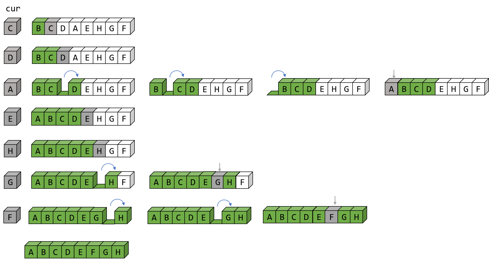

# 插入排序
当我们使用插入排序时，可以简单的将序列分为两部分：有序部分和无序部分。然后每次考虑一个元素，并将它插入到有序序列中正确的位置上。下面是插入排序（输出序列为一个非递减序列）的一个示例图：


对于无序部分，我们每次取其中的第一个数。然后从后向前扫描有序序列，找到合适的位置并插入。换句话说：在排序过程中，当前索引左边的元素已经有序，但这并不是他们的最终位置，如果碰到了比它们更小的元素，它们还必须后移，为较小的元素腾出位置。
```java
public static void insertionSort(int[] data) {
    for (int i = 1; i < data.length; i++) {
        int cur = data[i];
        int j = i;
        while (j > 0 && data[j - 1] > cur) {
            data[j] = data[j - 1];
            j--;
        }
        data[j] = cur;
    }
}
```