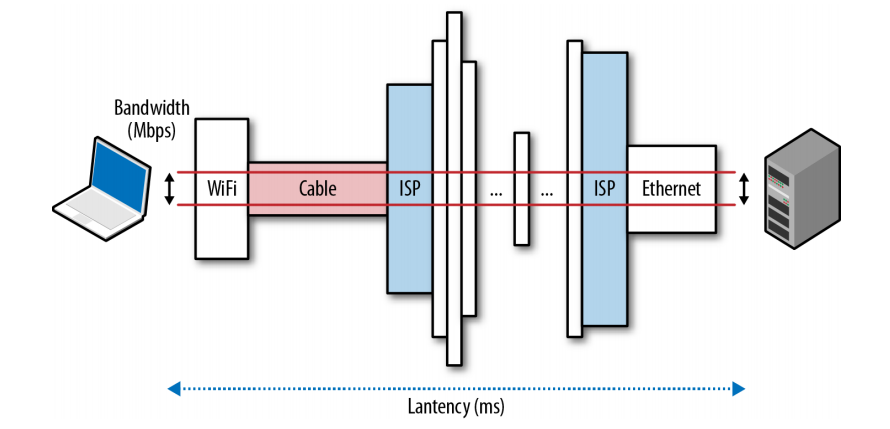

# 延迟与带宽
**延迟** 和**带宽**是衡量网络性能的两个关键指标。

## 延迟
**延迟(latency)**是指一个数据包(或一条消息)从发送到被接收这个过程中所花费的时间。

### 延迟的构成
对于通过因特网连接的一对客户端-服务器而言，延迟包含以下四部分：
* **传播延迟(Propagation delay)**：数据包从发送方到接收方所经过的时间，取决于发送方与接收方之间的距离与信号的传播速率
* **发送延迟(Transmission delay)**：将整个数据包传送到链路上所需时间，取决于包的长度和链路的传输速率
* **处理延迟(Processing delay)**：路由器处理包头，检测错误，以及决定包的目的地所花费的时间
* **排队延迟(Queuing delay)**：当包到达的速度超过了路由器的处理速度时，新抵达的数据包会在一个缓冲区中排队。数据包在队列中排队直到可以被处理所经过的时间就是排队延迟

一般而言，源到目标的距离越长，传播延迟就越长；源到目标之间的路由器越多，发送延迟和处理延迟就越长；路径上的负载越重，出现排队的可能性就越大；

数据包在传输介质中传播。一旦选定传输介质，包的传播速度其实也就定下来了。虽然难以使数据包传送得更快，但却可以把服务器放到离用户更近的地方，从而减少用户的等待时间，这其实就是CDN的工作原理。

### 最后一英里延迟
有趣的是，大量的传播延迟并不是出现在当数据包跨越大洋从一个大陆到另一个大陆的时候，而通常是出现在最后的几英里中。要能够连上Internet，ISP需要路由线缆、聚合信号并转发至路由节点。受连接类型、路由策略、发布技术等影响，数据包从用户到ISP的主路由器会耗费大量的时间。因此，选择一个合适的ISP有时候可以显著降低延迟。

## 带宽
**带宽(bandwidth)**是指一个逻辑或物理信道上的最大吞吐率，通常用单位时间内传输的比特数(`bit/s`)来表示。

### 采样定理(Nyquist–Shannon sampling theorem)
采样是将一个信号转换为数字序列的过程。Nyquist曾经推导出一个公式，用来表示一个有限带宽的<u>无噪声</u>信道的最大数据传输速率。后来，Shannon进一步把Nyquist的工作扩展到了有<u>随机噪声(热动力引起)</u>的信道的情形。

Nyquist证明，对于一个任意一个信号，如果这个信号通过了一个带宽为 **`B`** 的低通滤波器，那么只要进行每秒 **`2B`**次确切采样，就可以完全重构出被过滤的信号。如果信号包含了 **`V`** 个离散等级，那么Nyquist推导出的公式可以表示为：

$$
maximum\,data\,rate = 2Blog_2V\,bits/sec
$$

通过Nyquist定理，我们可以知道：在无噪声的1kHz信道上不可能以超过2000bit/s的速率传输二进制(离散等级为2)信号。

对于任何一个信道，由于系统中分子的运动，随机(热)噪声总是存在的。信号功率与噪声功率的比值被称为 **信噪比(SNR, Signal-to-Noise Ratio)**。如果将信号功率和噪声功率分别记作 **`S`**和 **`N`**，那么信噪比为：**`S/N`**。通常情况下，为了表示更大范围，信噪比会被写成对数形式($$10log_{10}S/N$$)，对数的取值单位称为 **分贝(dB, decibel)**。例如，10的信噪比为10分贝，而100的信噪比为20分贝。

Shannon的成果为：对于一个带宽为 **`B`**Hz，信噪比为 **`S/N`**的有噪声信道，其最大速率为：

$$
maximum\,number\,of\,bits/sec = Blog_2(1 + S/N)
$$

这告诉了我们实际信道能够获得的最大容量。

## 参考文献
1. Ilya Grigorik. <i>High Performance Browser Networking</i>. O'Reilly Media, 2013.
2. ANDREW S. TANENBAUM, DAVID J. WETHERALL. <i>Computer Networks, Fifth Edition</i>. Pearson, 2011.