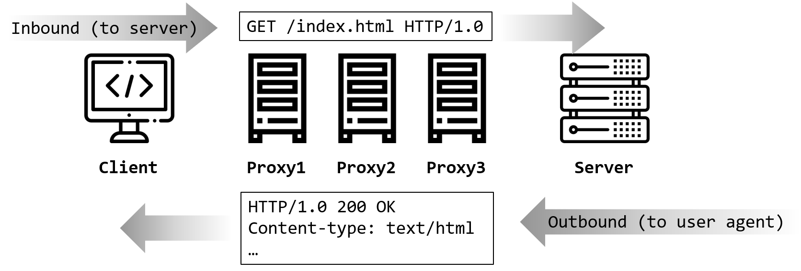
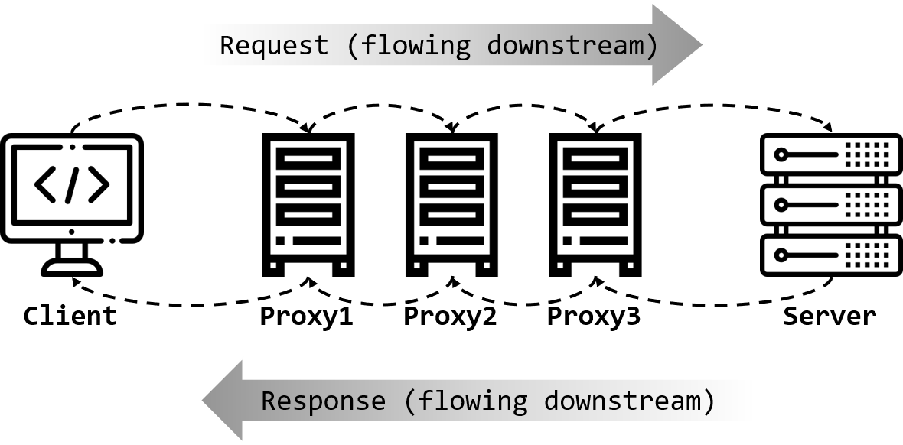

# HTTP报文
用于HTTP协议交互的信息被称为**HTTP报文（HTTP Messages）**。客户端发出的HTTP叫做请求报文（或**Requests**），服务端发出的报文叫做响应报文（或**Responses**）。

## 报文流
作为HTTP应用程序之间发送的数据块，HTTP报文以一些描述了报文内容及含义的文本形式的*元信息（meta-information）*开头，后面跟着可选的数据部分。这些报文在客户端、服务器和代理之间流动，术语**流入（inbound）**、**流出（outbound）**、**上游（upstream）**和**下游（downstream）**就是用来描述报文的方向的。

### Inbound与Outbound
HTTP使用术语*inbound*和*outbound*来描述事务处理的方向。报文流入源端服务器，处理完成之后又会流回用户的Agent代理中：



### Upstream与Downstream
不管是请求报文还是响应报文，所有的HTTP报文都会向*下游（downstream）*流动，所有的报文发送者都在接收者的*上游（upstream）*。报文只会从上游向下游流动，不存在从下游向上游流动的情况：



## 报文的组成
HTTP报文本身是由多行（用`CRLF`作换行符）数据构成的字符串文本，包括三个部分：对报文进行描述的**起始行（start line）**、包含报文属性的**首部（headers）**和可选的包含数据的**主体（body）**。例如:


起始行和首部都是由行分隔的ASCII文本，每行都以一个有两个字符组成的行终止符结束。这个行终止符包括一个回车符（Carriage Return, CR, ASCII码为13）和一个换行符（Line Feed, LF, ASCII码为10），`CR`和`LF`合起来就是`CRLF`。需要注意的是，尽管HTTP规范中说明应该用`CRLF`来表示行终止，但有些老的或不完整的应用程序并不总是同时发送`CR`和`LF`，所以应用程序也应该能处理这种情况。

报文的主体是一个可选的数据块。与起始行和首部不同的是，主体中可以包含文本或二进制数据，也可以为空。

### 报文的语法
所有的HTTP报文都可以分为两类：**请求报文（request message）**和**响应报文（response message）**。请求报文请求服务器执行一个操作，而响应报文则会将请求的结果返回给客户端。请求报文和响应报文的基本机构相同，但它们的格式有些许差异。

这是请求报文的格式：
```txt
<method> <request-URL> <version>
<headers>

<entity-body>
```
这是响应报文的格式（它和请求报文只有起始行不同）：
```txt
<version> <status> <reson-phrase>
<headers>

<entity-body>
```
下面是对报文格式中各组成部分的一个简短说明：
* **方法（method）**：告知服务器要做什么。
* **请求URL（request-URL）**：指定了所请求资源或URL里面`path`部分的完整URL。
* **版本（version）**：报文所使用的HTTP版本，格式为：`HTTP/<major-version>.<minor-version>`。
* **状态码（status-code）**：描述请求过程种发生的情况，每个状态码的第一位数字都对应一类状态。
* **原因短语（reason-phrase）**：这是状态码的可读版本，包含行终止符之前的所有文本。
* **首部（header）**：首部的数量可以为0个、1个或多个，每个首部都包含一个名字，名字后面跟着一个`:`，然后是一个可选的空格，接着是一个值，最后是一个`CRLF`。首部总是以一个空行（单个`CRLF`）结束。
* **主体（entity-body）**：主体部分包含一个由任意数据组成的数据块。这是一个可选的部分，并不是所有的报文都有主体部分，有时，报文只是以一个`CRLF`结束。

### 起始行
所有的HTTP报文都以一个起始行作为开始。请求报文的起始行说明了*要做什么*，而响应报文的起始行则说明了*发生了什么*。

#### 请求行
请求报文的起始行称为*请求行（request line）*。请求行包括三部分，即[报文的语法]部分介绍的方法、请求URL和版本，每个部分之间用空格分隔。

#### 响应行
响应报文的起始行称为*响应行（response line）*，它包含了响应报文所使用的HTTP版本、数字状态码和描述操作状态的原因短语。

#### 方法
请求行以方法开始，方法告知服务器要做什么。下面描述了7种常用的HTTP方法：

| 方法    | 描述                                       | 是否包含body |
| ------- | ------------------------------------------ | ------------ |
| GET     | 从服务器获取一份文档                       | 否           |
| HEAD    | 只从服务器获取文档的首部                   | 否           |
| POST    | 向服务器发送需要处理的数据                 | 是           |
| PUT     | 将请求的body部分存储在服务器上             | 是           |
| TRACE   | 对可能经过代理传送到服务器上的报文进行追踪 | 否           |
| OPTIONS | 决定可以在服务器上执行哪些方法             | 否           |
| DELETE  | 从服务器上删除一份文档                     | 否           |

并不是所有的服务器都实现了以上7种方法。此外，由于HTTP在设计上是易扩展的，一些服务器可能还会实现一些自己的请求方法。

#### 状态码

方法是客户端用来告知服务器做什么，而状态码是服务器用来告知客户端发生了什么的。状态码位于响应行中，状态码为数字，便于程序进行处理。而原因短语为文本，方便人们理解。状态码共有5个类别：

| 总范围    | 已定义范围 | 分类       |
| --------- | ---------- | ---------- |
| 100 ~ 199 | 100 ~ 101  | 信息提示   |
| 200 ~ 299 | 200 ~ 206  | 成功       |
| 300 ~ 399 | 300 ~ 305  | 重定向     |
| 400 ~ 499 | 400 ~ 415  | 客户端错误 |
| 500 ~ 599 | 500 ~ 505  | 服务器错误 |

#### 原因短语

原因短语是响应行中的最后一个部分，它为状态码提供了文本形式的解释，方便人们理解。状态码和原因短语总是成对出现。

#### 版本号

版本号会以`HTTP/x.y`的形式出现在起始行中，HTTP应用程序用它来告诉对方自己所遵循的协议版本，以便双方互相理解。版本号说明了应用程序支持的最高HTTP版本。

### 首部

HTTP的起始行后会有0个、1个或多个首部字段，首部字段为报文添加了一些附加信息。首部字段本质为一个键-值对列表。

HTTP规范定义了几种类型的首部：

* 通用首部：既可以出现在请求报文中，也可以出现在响应报文中。
* 请求首部：提供更多有关请求的信息。
* 响应首部：提供更多有关响应的信息。
* 实体首部：描述body的长度和内容，或资源本身。
* 扩展首部：规范中没有定义的新首部。

除了HTTP规范定义的几种首部字段外，应用程序也可以随意发明自己所用的首部。

### 主体

作为HTTP报文的最后一部分，body就是HTTP报文要传输的内容。

## 参考资料
1. David Gourley, Brian Totty. HTTP: The Definitive Guide. O'Reilly Media, 2002.