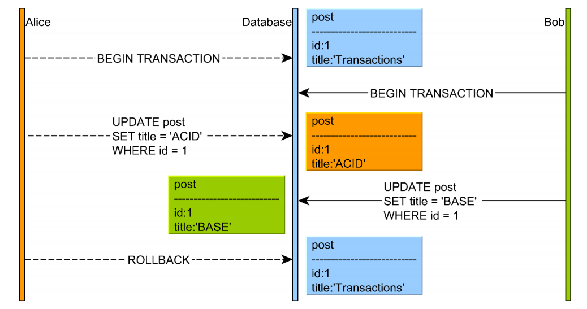
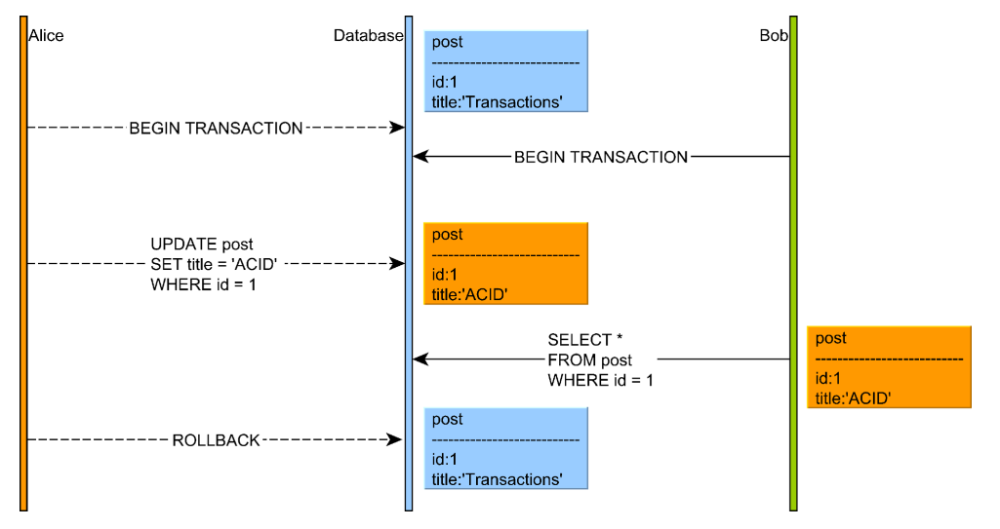
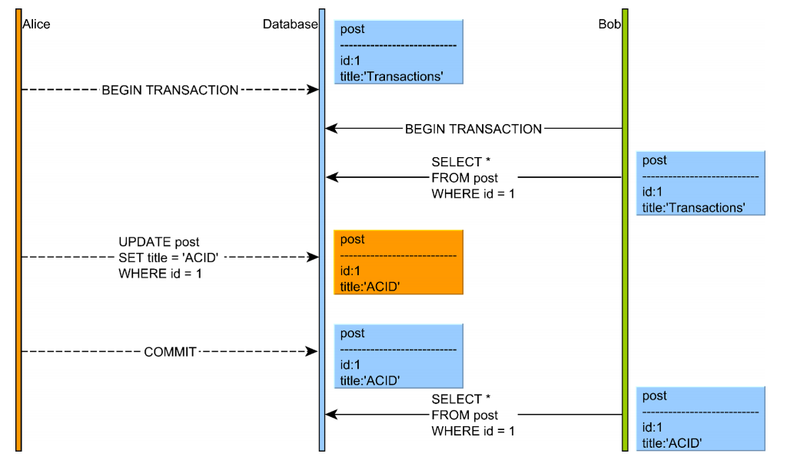
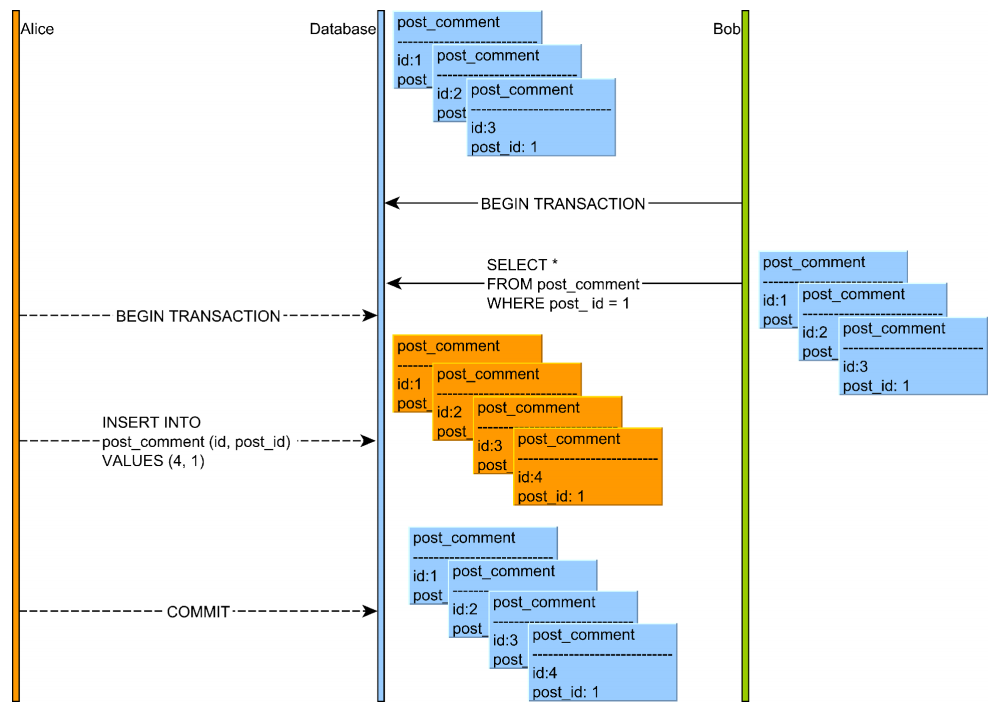
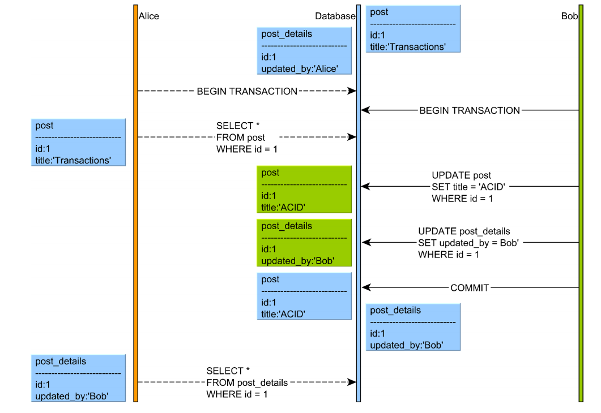
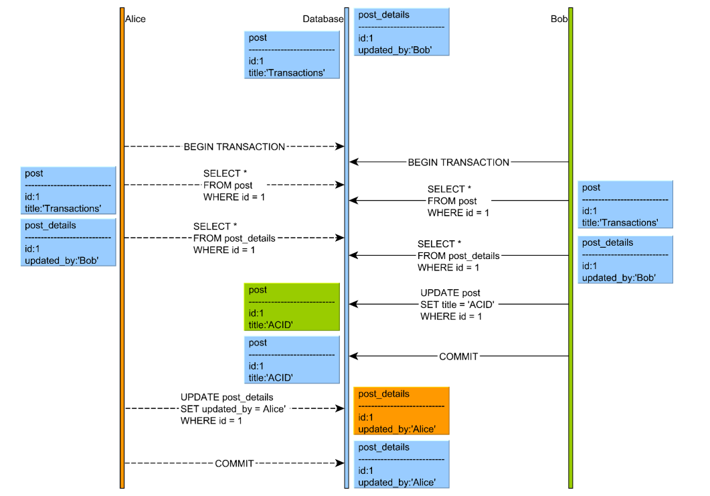
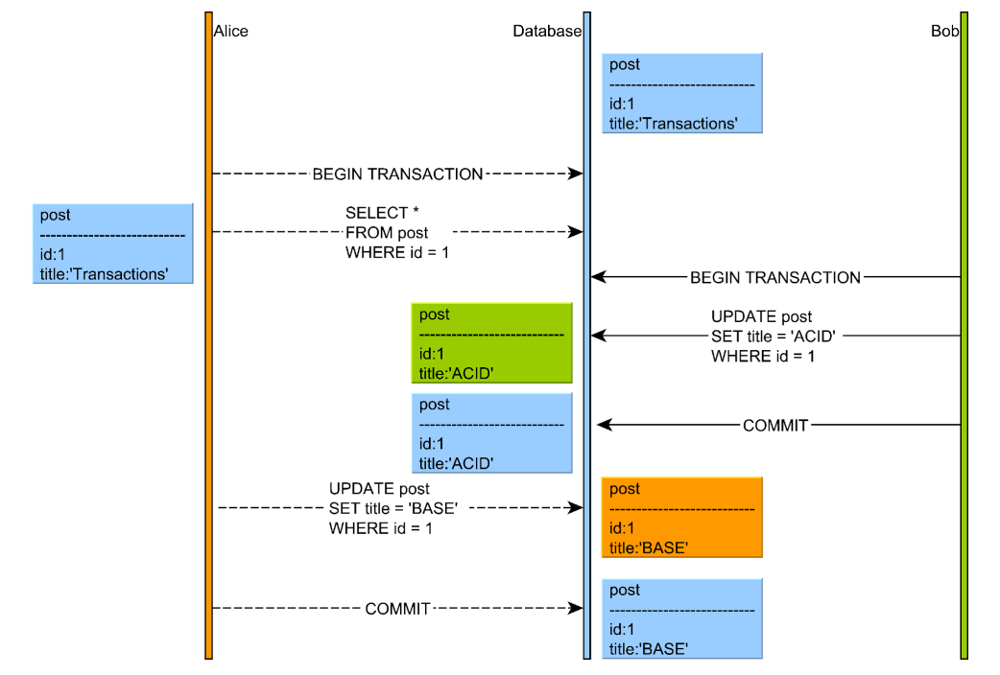

> **事务**是由一组读写操作组成的一个<u>不可分割</u>的执行单元，这组操作<u>要么全部成功，要么全部失败</u>。

# 事务的ACID特性

## 原子性(Atomicity)
多个操作可以构成一个逻辑工作单元。当且仅当工作单元内的所有操作都成功，这个工作单元才成功，若有操作执行失败，则必须回滚所有已执行操作并恢复到未执行时的状态，这就是事务的 **原子性**。

## 一致性(Consistency)
一致性和事务状态的改变紧密相关的，当事务涉及修改操作时，可以将其看作状态迁移，数据库会从一个有效状态迁移到另一个有效状态。**一致性**就是指系统从一个正确的状态迁移到另一个正确的状态。当系统的状态违反某个约束时，整个事务都会回滚，所有的修改都会被撤销。

## 隔离性(Isolation)
**可串行化**：若几个事务不管以何种顺序执行，最终系统的状态都是一样的，则这几个事务是可串行化的。

如果几个事务并发执行，即使每个事务都能确保一致性和原子性，它们的操作也可能会以我们以希望的某种顺序交叉运行，最终导致不一致状态。 只有当这些事务是可串行化的，最终的结果才会一致。

数据库系统必须保证事务能够正常执行而不被并发执行的其它操作所影响，这就是**隔离性**。

## 持久性(Durability)
当一个事务完成后，它对数据库的改变必须是永久的，就是系统出现故障也不会对数据的改变造成影响，这就是**持久性**。

# 并发控制
为了解决数据冲突，通常有两种基本策略：
* **冲突避免**：使用锁控制共享资源，比如两阶段锁（2PL, two-phase locking）
* **冲突检测**：并发性更好，但可能导致数据异常，比如多版本并发控制（MVCC, Multi-Version Concurrency Control）

## 两阶段锁
为了减少共享资源访问的冲突，关系型数据库采用了多粒度锁。数据库对象天生就是层次结构的，一个逻辑表空间可能被映射到多个数据库文件，而一个数据库文件由数据页构成，每页又包含很多行…… 因此，不同的数据库对象都可以获得锁。

低级别的锁（比如：行级锁）粒度较小，减小了竞争的可能，可以提供更好的并发控制。然而，每个锁都是会消耗资源的，维持大量的低级别锁，也会带来可观的资源开销。因此，数据库可能会决定用一个稍微高级别的锁代替这些低级别的锁，这就是锁升级。这就是可并发性和资源消耗之间的一个权衡。

不同数据库的锁都有自己的层级结构，最常见的锁有下面两种：
* 共享锁（读锁）：一旦加锁，允许并发读，不允许写
* 互斥锁（写锁）：一旦加锁，既不允许写也不允许读

两阶段锁保证了可串行性，协议要求每个事务分为两个阶段：
* 增长阶段：只可获取锁，不可释放锁
* 缩减阶段：只可释放锁，不可获取锁
最初，事务处于增长阶段，事务可以根据需要获取锁。一旦事务开始释放锁，便进入缩减阶段，并且不能再发出加锁请求。

## 多版本并发控制
最初，所有的数据库系统都是用两阶段锁来实现可串行化的事务。后来，很多数据库厂商改用了多版本并发控制(MVCC)。

尽管锁可以提供可串行化的事务调度，锁竞争的代价还是会破坏事务的响应时间和可扩展性。为了克服这个缺点，数据库厂商们选择了乐观并发控制机制。如果认为两阶段锁使用的是冲突避免策略，那么MVVC使用的就是冲突检测策略。

为了防止阻塞，数据库进行版本控制，然后可以重建数据库记录的早期版本，未提交的改变可能对后来的用户不可见。缺乏锁的协助，实现可串行化调度更加困难，数据库引擎必须分析当前的交叉操作并检测影响串行化的异常。

MVCC的实现是通过保存数据在某个时间点的快照来实现的。也就是说，不管执行多长时间，每个事务看到的数据都是一致的。根据事务开始时间的不同，每个事务对同一张表，同一个时刻看到的数据可能是不一样的。

# 数据库异象(Phenomena)

严格保证数据一致性的代价太高，有必要降低事务串行化的保证程度，使用多个隔离级别，但这会导致Phenomena的出现。

SQL-92标准提出了三种phenomena:
* 脏读(dirty read)
* 不可重复读(non-repeatable read)
* 幻读(phantom read)
现实中，还有其它的phenomena：
* 脏写(dirty write)
* 读偏(read skew)
* 写偏(write skew)
* 更新丢失(loss update)

## 脏写
当两个并发事务都被允许同时修改同一行时，脏写就发生了。

如果两个事务都提交，后面提交的事务会覆盖先提交的事务，造成更新丢失。如果某个事务选择回滚，也会带来问题。如果数据库引擎不能阻止脏写，就不能有效保证回滚，因为原子性不能在缺乏回滚机制的情况下得到保证。
最低的隔离级别——**读取未提交**就可以避免脏写。

## 脏读
解决脏写之后，我们面临的问题是脏读。当一个事务被允许读取另一个事务未提交的改变，就会发生脏读。也就是说，读取未提交这一隔离级别不能防止脏读。

为了防止脏读，数据库引擎必须防止其他的并发事务读取当前事务未提交的改变。换句话说，隔离级别——**读取已提交**可以防止脏读。在实际应用中，读取已提交通常是最低的隔离级别。

## 不可重复读
解决了脏读，我们面临的问题是不可重复读。若一个事务要多次读取数据库中的数据A又没有给A加共享锁时，其它事务可能在第一个事务结束之前修改掉A的值，最终导致第一个事务多次读取到的内容不一致，这就是不可重复读。

为了避免这个问题，我们需要的最低隔离级别为**可重复读**。可重复读意味着：只允许读取已提交的数据，而且在一个事务两次读取同一个数据项期间，不允许其它事务修改这个数据项.

## 幻读
当我们解决了不可重复读问题之后，还会碰到幻读的情况。
幻读发生在正在执行的事务T1在读取一个范围内的数据时（包括统计查询）没有加锁，另外一个事务T2执行了和之前范围有交集的插入操作。比如T1在T2之前读到的A的值是3，但T2执行时有交集，插入了新的数据，这个时候A变成了4，如果T1再次读取A的话，就会发现A变成了4而不是之前的3，这就是幻读。

不可重复读和幻读的区别：不可重复读的重点是数据的<u>修改</u>，比如多次读取同一条记录发现其中某些列被修改；而幻读的重点在于数据的<u>插入或删除</u>，比如多次读取一个集合内的数据，会发现该集合内的数据增多了或减少了

隔离级别——**可串行化**可以避免幻读。一旦事务完全串行化，并发性就非常弱了。

## 读偏
读偏发生在当两张数据表之间有一个总的约束的时候。比如表A和表B必须同步改变，当事务T1在读取表A的数据项a和表B的数据项b时，事务T2插了进来更新了数据项a和b，最终导致事务T1读到了a的旧值和b的新值，这就是读偏。

为了解决读偏，事务T1在读取数据是可以**使用共享锁**防止事务T2更新数据。

## 写偏
写偏和读偏类似。假设表A的数据项a和表B的数据项b在单个事务内必须同步改变，若允许写偏，则事务T1更新了表A的数据项a，事务T2也更新了表B的数据项b，T1和T2两个事务独立的更新了这两条记录，最终打破了二者必须同时改变的约束。

不同于读偏，有两种方式可以解决写偏：
* 第一个事务获取两个数据项上的共享锁，这能防止第二个事务更新这两个数据项。
* 数据库引擎可以检测第二个事务修改了相关记录，然后强制第一个事务回滚。

## 更新丢失
当事务T1读取某个数据项a然后修改a，另一个事务T2却在事务T1读取a之后修改a之前修改了a，这个时候事务T2所作的更新就丢失了，T1根本察觉不到T2的存在。

先分析下更新丢失的情况：首先，没有脏写，因为T2已经提交。其次，没有脏读，因为在写之后没有读操作。可重复读就可避免更新丢失问题。

# 隔离级别
SQL标准定义了4个隔离级别：
* **READ UNCOMMITTED**： 最低的隔离级别，允许读取未提交的数据。可能导致脏读、不可重复读或幻读。
* **READ COMMITTED**：允许读取并发事务已经提交的数据。可以防止脏读，但不可重复读和幻读仍然有可能发生。
* **REPEATABLE READ**：除非数据被事物本身修改，对同一记录的多次读取结果都是一致的。可以防止脏读和不可重复读，但可能发生幻读。
* **SERIALIZABLE**：事务串行执行，可以防止脏读、不可重复读和幻读。

下表展示了各隔离级别及其能够防止的异象：

|                              | 脏读(Dirty Read) | 不可重复读(Non-repeatable Read) | 幻读(Phantom Read) |
| ---------------------------- | ---------------- | ------------------------------- | ------------------ |
| 读取未提交(Read Uncommitted) | 是               | 是                              | 是                |
| 读取已提交(Read Committed)   | 否               | 是                              | 是                 |
| 可重复读(Repeatable Read)    | 否               | 否                              | 是                 |
| 可串行化(Serializable)       | 否               | 否                              | 否                 |

MySQL默认的隔离级别为可重复读，而Oracle、SQL Server和PostgreSQL默认的隔离界别为读取已提交。

# 参考文献
1. Vlad Mihalcea. <i>High Performance Java Persistence: Get the most out of your persistence layer</i>. 2015.
2. Abaham Siberschatz, Henry F.Kort, S.Sudarshan. 数据库系统概念(第六版). 杨冬青, 李红燕, 唐世渭, 译. 机械工业出版社, 2013.