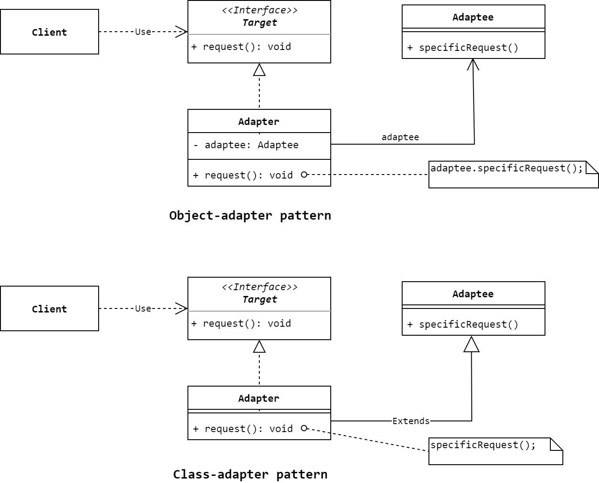

# 适配器模式
> Convert the interface of a class into another interface clients expect. Adapter
lets classes work together that couldn't otherwise because of incompatible
interfaces. 

**适配器模式(Adapter Pattern)**属于结构型模式，**Adapter**又称**Wrapper**。适配器模式的目标是：使对象一起工作，即使它们的接口并不兼容。根据实现方式的不同，适配器又可以分为*类适配器(class adapter)*和*对象适配器(object adapter)*，前者使用继承机制，而后者使用组合机制。

## 模式的结构与实现

### 结构


### 参与者
* **Target(目标接口)**
    * 定义由Client使用的接口。**Target**不仅可以是接口，还可以是抽象类或具体类。
* **Adpatee(适配者)**
    * 定义一个已经存在的接口，这个接口需要被适配。
* **Adapter(适配器)**
    * 完成从**Adaptee**接口到**Target**接口的适配。

### 示例
首先定义 **`Target`** 类和 **`Adaptee`** 类：
```Java
// 目标接口
public interface Target {
    // 目标方法
    void request();
}

// 适配者类
public class Adaptee {
    public void specificRequest() {
        System.out.println("I'm the mothod [specificRequest] in Adaptee.");
    }
}
```
先来看对象适配器类的 **`Adapter`**，以及相应的客户端类：
```Java
// 对象适配器
public class Adapter implements Target {
    private Adaptee adaptee;

    public Adapter(Adaptee adaptee) {
        this.adaptee = adaptee;
    }

    @Override
    public void request() {
        System.out.println("Adapt method [specificRequest] to method [request] begin ...");
        adaptee.specificRequest();
        System.out.println("Adapt method [specificRequest] to method [request] end ...");
    }
}

// 客户端类
public class Client {
    public static void main(String[] args) {
        Target target = new Adapter(new Adaptee());
        target.request();
    }
}
```

再来看类适配器类的 **`Adapter`**，以及相应的客户端类：
```Java
// 类适配器
public class Adapter extends Adaptee implements Target {
    @Override
    public void request() {
        System.out.println("Adapt method [specificRequest] to method [request] begin ...");
        specificRequest();
        System.out.println("Adapt method [specificRequest] to method [request] end ...");
    }
}

// 客户端类
public class Client {
    public static void main(String[] args) {
        Target target = new Adapter();
        target.request();
    }
}
```

运行客户端类(任意一个)都可以输出以下结果：
```txt
Adapt method [specificRequest] to method [request] begin ...
I'm the mothod [specificRequest] in Adaptee.
Adapt method [specificRequest] to method [request] end ...
```

## 使用场景
Java中的 **`InputStreamReader`** 就是对象适配器的一个例子，它将 **`InputStream`** 适配到 **`Reader`**。

## 对象适配器 vs 类适配器
对象适配器和类适配器各有优劣。对象适配器：
* 一个Adapter可以适配多个Adaptee，Adapter还可以一次性为所有的Adaptee添加额外的功能。
* 重定义Adaptee行为的难度会更大。因为这需要生成Adaptee的子类并使得Adapter引用这个子类而不是Adaptee本身。

而类适配器：
* 采用一个具体Adapter类适配Adaptee到Target，当我们想在一个类及其所有子类之间进行适配时，类适配器是无法做到的。
* 因为Adapter是Adaptee的子类，所以Adapter可以很方便的重定义Adaptee的行为。
* 不需要额外的指针去引用Adaptee。

## 参考资料
1. 《Design Patterns: Elements of Reusable Object-Oriented Software》.
2. 《设计模式的艺术：软件开发人员内功修炼之道》.