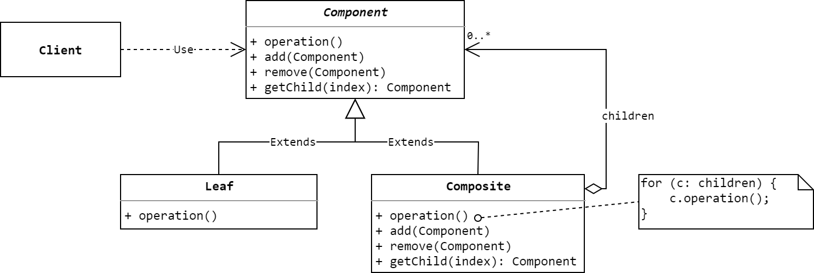

# 组合模式
> Compose objects into tree structures to represent part-whole hierarchies.
Composite lets clients treat individual objects and compositions of objects
uniformly. 

**组合模式(Composite Pattern)**是一种结构型模式，又称**部分-整体模式(Part-Whole Pattern)**。

## 模式的结构与实现

### 结构



### 参与者
* **Component(抽象组件类)**
    * 为组合结构中的对象声明接口。
    * 在适当的情况下，实现所有公共接口的默认行为。
    * 声明用于访问和管理子组件的接口。
    * (可选)定义子组件在递归结构中访问父组件的方法，并在合适的情况下实现它。
* **Leaf(叶子组件类)**
    * 代表整个组合结构中的叶子节点，叶子节点没有子组件。
    * 定义整个组合结构中该叶子组件的行为。
* **Composite(容器类)**
    * 存储子组件。
    * 定义有子组件的那部分组件的行为。
    * 实现在Component中定义的和子组件有关的操作。

### 示例
先来定义 **`Component`**类，它实现了组件的默认行为：
```Java
public abstract class Component {
    public void add(Component c) {}
    public void remove(Component c) {}
    public Component getChild(int i){return null;}
    public abstract void operation();
}
```
再来定义 **`Leaf`**类：
```Java
public class Leaf extends Component{
    @Override
    public void operation() {
        System.out.println("Performing operation defined in Leaf[" + this.hashCode() + "].");
    }
}
```
**`Composite`**类，其内部采用一个 **`ArrayList`** 保存所有的子组件：
```Java
public class Composite extends Component {
    private ArrayList<Component> children = new ArrayList<>();

    @Override
    public void add(Component c) {
        this.children.add(c);
    }

    @Override
    public void remove(Component c) {
        this.children.remove(c);
    }

    @Override
    public Component getChild(int i) {
        return children.get(i);
    }

    @Override
    public void operation() {
        System.out.println("Performing operation defined in Composite[" + this.hashCode() + "].");
        for (Component c: children) {
            c.operation();
        }
    }
}
```
最后是测试用的客户端类：
```Java
public class Client {
    public static void main(String[] args) {
        Component leaf1 = new Leaf();
        Component leaf2 = new Leaf();
        Component root = new Composite();
        Component nonLeafNode = new Composite();

        nonLeafNode.add(leaf2);
        root.add(leaf1);
        root.add(nonLeafNode);

        root.operation();
    }
}
```
运行测试代码，即可得到类似于以下的结果，这里使用了`hashCode`区分不同的对象：
```txt
Performing operation defined in Composite[997110508].
Performing operation defined in Leaf[99347477].
Performing operation defined in Composite[566034357].
Performing operation defined in Leaf[940553268].
```

客户端通过Component接口与组合结构中的对象交互，如果接收对象是叶节点，则直接处理请求。如果接收对象是Composite，它通常将请求转发给它的子组件，在转发请求的前后还可能执行一些辅助操作。

## 使用场景
组合模式一般用在以下场景：
* 需要表示的对象具有*部分-整体*的层次结构。
* 希望使用者忽略组合对象与叶子对象的不同之处，统一对待它们。

文件系统的表示就是一个天然的*部分-整体*结构，非常适用于组合模式。

## 小结
组合模式主要用在具有*整体-部分*结构的层次结构中，一致对待整体和部分，这一般是一个树形结构。使用组合模式，可以清楚的定义分层次的复杂对象，使得客户端可以忽略层次之间的差异，方便对整个结构进行控制，简化操作。在组合模式中增加新的叶子组件和容器组件时非常方便，不用修改已有代码，符合开闭原则。但是，组合模式很难在增加新构件的时候对构件的类型进行限制。

## 参考资料
1. 《Design Patterns: Elements of Reusable Object-Oriented Software》.
2. 《设计模式的艺术：软件开发人员内功修炼之道》.