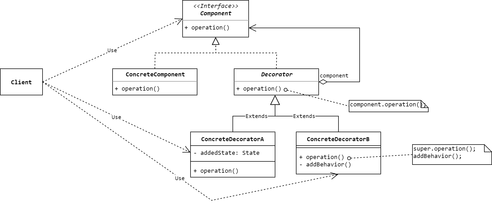

# 装饰器模式
> Attach additional responsibilities to an object dynamically. Decorators provide a flexible alternative to subclassing for extending functionality. 

**装饰器模式(Decorator Pattern)**是一种结构型模式，**Decorator**又称**Wrapper**。

当我们想向一个类添加新的方法或者给对象赋予新的职责时，最简单的方式就是先继承这个类，再将方法添加到子类中。然而，在单继承的语言里，这种方式不够灵活，可能带来非常笨重的类体系，还会有代码冗余的风险。一个更加灵活的做法就是采用装饰器模式，将原来的类包裹在**装饰器(decorator)**中。装饰器提供与被装饰者一样的接口，因此对使用被装饰者的客户端来说是透明的。装饰器将客户端的请求转发给被装饰者，并可能在转发前后添加一些额外的动作。

## 模式的结构与实现

### 结构



### 参与者
* **Component(抽象组件类)**
    * 为对象定义接口，声明具体 **`ConcreteComponent`** 中的业务方法。装饰器将动态地为这里的对象添加职责。
* **ConcreteComponent(具体组件类)**
    * 实现 **`Component`** ，从而定义具体的组件。装饰器将为它添加额外的职责。
* **Decorator(抽象装饰器)**
    * 它是整个模式的核心，实现了 **`Component`** 接口。它维护了一个对 **`Component`** 对象的引用，通过这个引用可以调用被装饰对象的方法，通过子类扩展这个方法就可以达到装饰的目的。
* **ConcreteDecorator(具体装饰器)**
    * 它继承了 **`Decorator`**，负责给 **`Component`** 添加新的职责。每一个 **`ConcreteDecorator`** 都定义了各自新的职责。

### 实现
首先定义 **`Componnet`** 和 **`ConcreteComponent`**：
```Java
public interface Component {
    void operation();
}

public class ConcreteComponent implements Component {
    @Override
    public void operation() {
        System.out.println("Operating something in concrete component ...");
    }
}
```
接着定义 **`Decorator`** 和 **`ConcreteDecorator`**：
```Java
public abstract class Decorator implements Component {
    protected Component component;

    public Decorator(Component component) {
        this.component = component;
    }

    @Override
    public void operation() {
        component.operation();
    }
}

public class ConcreteDecoratorB extends Decorator {
    public ConcreteDecoratorB(Component component) {
        super(component);
    }

    @Override
    public void operation() {
        super.operation();
        addBehavior();
    }

    private void addBehavior() {
        System.out.println("Attaching new responsibilities to concrete component ...");
    }
}
```
最后是测试用的客户端类：
```Java
public class Client {
    public static void main(String[] args) {
        Component component1 = new ConcreteComponent();
        Component component2 = new ConcreteDecoratorB(component1);  // decorate component1 with component2
        component2.operation();
    }
}
```
运行客户端类，可以得到以下结果：
```txt
Operating something in concrete component ...
Attaching new responsibilities to concrete component ...
```

在实现装饰器模式时，需要保持接口的一致性。各Decorator的接口必须与被装饰的Component接口一致，因此，所有的ConcreteDecorator都必须有一个公共的父类。此外，ConcreteComponent和Decorator也必须将Component作为公共父类。

## 使用场景
装饰器模式可以在以下情况使用：
* 在不影响其它对象的情况下，以动态、透明的方式给单个对象添加职责。
* 处理那些可以被撤销的职责。
* 不能采用继承的方式对类的职责进行扩充。

装饰器模式的一个典型就是 **`java.io.InputStream`** 及其相关类。**`ConcreteComponent`**如 **`FileInputStream`** 和 **`SocketInputStream`** ，装饰器如 **`BufferedInputStream`** 和 **`DataInputStream`**，等等。

## 小结
总的来说，使用装饰器模式可以带来两个重大好处：
1. 比静态继承更大的灵活性。通过装饰器，可以在运行期间为对象增加或减少职责。而在静态继承中，增加新的职责只能通过实例化类来实现。
2. 可以避免由编程语言特性而引起的庞大的类继承结构。这一点在像Java这样的单继承语言里面尤为明显。

但是，不正确的使用装饰器模式可能放大以下潜在的问题：
1. 装饰器本身与被它装饰的组件本身并不相同。装饰器是原组件的一个透明包装，从对象标识的角度来看，两者并不是同一个对象。因此，使用装饰器的时候不应该依赖对象标识。
2. 采用装饰器模式时，系统中往往会产生很多小对象，大量的小对象会占用更多的系统资源。

## 参考资料
1. 《Design Patterns: Elements of Reusable Object-Oriented Software》.
2. 《设计模式的艺术：软件开发人员内功修炼之道》.