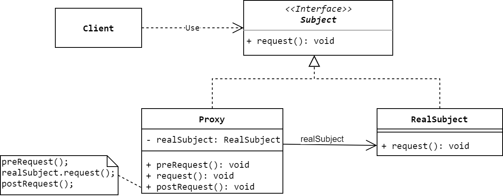

# 代理模式
> Provide a surrogate or placeholder for another object to control access to it.

**代理模式(Proxy Pattern)**属于结构型模式，**Proxy**又称**Surrogate**，其主要思想为：给某一个对象提供一个代理，并由代理对象控制对原对象的引用。因为代理模式中引入了一个新的代理对象，代理对象可以在客户端和目标对象之间起到中介的作用，所以可以去掉客户端不应该看到的内容或服务或者给客户端提供额外的服务。

## 模式的结构与实现

### 结构


### 参与者
* **Proxy(代理类)**
  * 持有一个可以用来访问 **`RealSubject`** 对象的引用。通常在代理类中，客户端在调用 **`RealSubject`** 对象方法的前后还会进行一些其它的操作，这些其它操作可以由代理类提供。
  * 提供和 **`Subject`** 一样的接口，使得代理类可以代替 **`RealSubject`**对象。
  * 控制对 **`RealSubject`**对象的访问，可能还会负责该对象的创建和删除。
* **Subject(抽象主题类)** 
  * 定义 **`RealSubject`** 和 **`Proxy`** 共有的接口，以便在任何使用 **`RealSubject`** 的地方都可以使用代理。
* **RealSubject(真实主题类)**
  * 定义代理所代表的 **`RealSubject`**。它包含真实的业务操作，客户端可以通过代理对象间接调用这些业务操作。

### 实现
根据UML图，可以写出以下代码：
```Java
public interface Subject{void request();}

public class RealSubject implements Subject {
    @Override
    public void request() {System.out.println("Request of RealSubject instance.");}
}

public class Proxy implements Subject {
    private final RealSubject realSubject = new RealSubject();

    public void preRequest(){System.out.println("PreRequest.");}
    public void postRequest(){System.out.println("PostRequest.");}

    @Override
    public void request() {
        preRequest();
        System.out.println("Request of Proxy.");
        realSubject.request();
        postRequest();
    }
}

public class Client {
    public static void main(String[] args) {new Proxy().request();}
}
```
运行 **`Client`**类，可以得到以下结果：
```txt
PreRequest.
Request of Proxy.
Request of RealSubject instance.
PostRequest.
```
在上面的代码中，客户端不仅通过代理类调用了真实主题类的方法，还在其前后调用了一些其它的方法。

在实现代理模式时，Proxy并不总是需要知道Subject的具体类型。若Proxy能够完全通过一个抽象接口来处理它的Subject，则无须为每一个RealSubject都生成一个Proxy，Proxy可以统一处理所有的RealSubject。但是，如果Proxy需要实例化RealSubject(例如虚拟代理)，那么就必须知道Subject的具体类型。

## 使用场景
下面是一些可以使用代理模式的场景：
* **虚拟代理(Virtual Proxy)**按需创建开销很大的对象。Spring框架中的**`LazyConnectionDataSourceProxy`** 就是一个例子，它将JDBC **`DataSource`**的创建推迟到了第一条**`Statement`**被创建之后。
* **远程代理(Remote Proxy)**为不同地址空间(比如在远程机器上)中的对象提供局部表示。需要注意的是，远程代理并不直接持有指向远程对象的指针，但可以通过RPC、RMI、Thrift、ProtoBuf、gRPC、REST、HTTP、TCP/UDP等远程机制来调用对象的方法。
* **保护代理(Protection Proxy)**控制对原始对象的访问，这可以用来实现对对象的访问控制。`Collections.synchronizedCollection()`就是一个例子，它返回的新`Collection`是线程安全的。


## 小结
代理模式能够协调调用者和被调用者，在一定程度上降低了系统的耦合度，符合迪米特法则。客户端可以针对抽象接口编程，增加和更换代理类无须修改原有代码，符合开闭原则，利于系统的扩展。

由于代理对象出现在客户端和真实对象之间，这加大了客户端和真实对象之间的距离，可能会降低请求的处理速度。同时，代理模式的实现也需要额外工作，这可能加大系统的复杂性。

## 参考资料
1. 《Design Patterns: Elements of Reusable Object-Oriented Software》.
2. 《设计模式的艺术：软件开发人员内功修炼之道》.