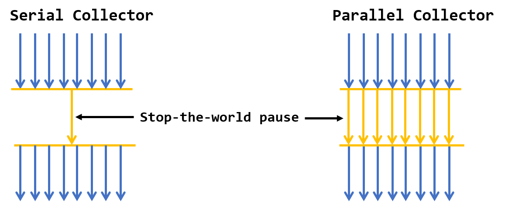
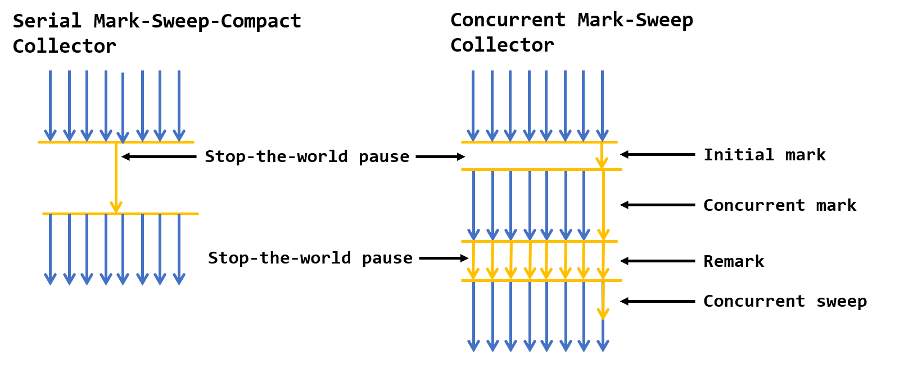

> 这篇笔记的主要内容来自[Memory Management in the Java HotSpot VM](https://www.oracle.com/technetwork/java/javase/memorymanagement-whitepaper-150215.pdf)。其主要讲的是J2SE 5.0中HotSpot VM的内存管理，文章中描述了J2SE5.0中的垃圾收集器，并在如何选择和配置垃圾收集器、设置被管理内存的区域大小等方面提出了一些建议。

# HotSpot VM中的内存管理(J2SE 5.0)
内存管理系统需要考虑以下三个方面：
1. 如何分配内存。
2. 如何识别存活对象。
3. 如何回收死亡对象占据的空间，以便将来使用。

## 显式内存释放 vs 自动内存管理

### 动态内存分配
几乎所有的现代编程语言都采用**动态内存分配(dynamic momory allocation)**，即允许进程在运行时分配或释放那些无法在编译期间确定大小的对象，并且对象的存活时间可以超过创建它们的子程序的存活时间。动态分配的对象并不位于于栈(即位于分配对象的程序的*活动记录(activation record)*或*栈帧(stack frame)*中)上，也没有被静态储存(即对象的名字被绑定到编译或链接期间所确定的存储位置)，而是位于堆(heap)中。在堆中分配对象有一些好处，它允许程序员：
* 动态选择新对象的大小，从而避免程序运行中出现因硬编码而出现的一些错误。
* 定义和使用像list、tree、map这样的递归数据结构。
* 将新创建的对象返回给父程序。例如工厂方法。
* 将函数作为另一个函数的返回结果。例如一些函数式编程语言中的*closure*和*suspension*。

堆中分配的对象是通过**引用(reference)**来访问的。通常，引用是一个指向对象的指针，即对象在内存中的地址。然而，引用也可能间接地指向对象，例如引用指向**句柄(handle)**，句柄再指向对象。句柄的优点是：在对象被移动时，只需要更新句柄中到对象的指针，而不需要更新程序中所有其它对该对象(或句柄)的引用。

### 显式内存释放
在一些编程语言里，程序员需要手动管理内存。手动管理内存一件非常复杂的工作，并可能出现很多错误，这些错误可能导致程序异常甚至崩溃。因此，绝大部分开发时间都被用在了调试并尝试解决这些问题上。手动回收可能会出现以下两个问题：
1. **悬挂指针(dangling pointer)**。当一个对象还被其它对象引用时，若该对象占用的内存被回收，那些指向它的引用就会称为悬挂指针。悬挂指针一旦出现，程序的行为就会变得不可预测。因为，当尝试通过悬挂指针访问原对象时，被引用的内存空间可能早已分配给其它对象。
2. **内存泄漏(memory leak)**。例如，为了释放一个单链表所占用的内存空间，我们需要回收链表中的所有节点，若只回收了头节点，其它节点就无法再被访问，它们占据的内存空间也就无法被回收。内存泄漏会不断的消耗可用内存，直至内存枯竭。

### 自动内存管理
自动化内存管理解决了显示内存管理中的很多问题。**垃圾收集(GC)**防止可以防止悬挂指针的出现，因为只有当一个对象不被任何其它对象引用时，这个对象才能被回收。原则上讲，GC会回收所有不可达对象，但有两点需要注意：
1. *追踪式回收(tracing collection)*引入了“垃圾”这一定义明确的概念，但“垃圾”并不一定包括所有不再被使用的对象。
2. 出于效率原因，某些对象可能不会被回收。

GC还解决了内存泄漏的问题，因为它会自动释放所有不再被引用的对象。

## 什么是垃圾收集
简而言之，垃圾收集器负责：
1. 为新生对象分配内存。
2. 保证不回收被引用的对象。
3. 回收那么不再可达对象的所占据内存空间。

垃圾收集是指发现垃圾并回收的这一过程。那么何时会发生垃圾收集呢，这要看使用何种垃圾收集器(或垃圾收集算法)了。通常情况下，当堆或堆的一部分已满，或已分配的空间超过了某个阈值时，就会进行垃圾收集。

### 垃圾收集器的特点
一个理想的垃圾收集器应该具备以下特点：
1. 既**安全(safe)**，又**完全(comprehensive)**。也就是说，存活对象不能被错误的回收，并且一个垃圾不应该在经过几轮回收之后依然存在。
2. **高效(efficient)**，它不会长时间暂停应用程序。
3. **减少甚至消除内存碎片**。**整理(compaction)**就是一种消除碎片的方式。
4. **可伸缩(scalable)**。对于多处理器系统上的多线程应用来说，内存的分配与回收都不应该成为性能瓶颈。

### 设计选择
当设计或选择垃圾回收算法时，需要考虑很多点：
* **Serial vs Parallel**。串行简单但慢，并行快但更复杂并且可能导致内存碎片。
* **Concurrent vs Stop-the-world**。并发复杂但暂停应用时间短且可能影响程序性能，STW简单但暂停应用时间长。
* **Compacting vs Non-compacting vs Copying**。整理式收集器将所有存活对象移动到一起并完全回收其它内存，为新对象分配内存简单又快速。非整理式收集器原地释放垃圾对象的空间，即不移动对象，它更快但可能导致内存碎片，还可能加大为大对象寻找合适内存空间的难度。复制式收集器将存活对象复制到一个不同的内存区域，源空间可以直接被认为是完全空闲的，接下来可以直接在它上面为新对象分配内存，这既简单又迅速，但需要额外的时间来复制对象以及额外的空间来存储复制后的对象。

### 性能指标
有很多指标可以用来衡量垃圾收集器的性能：
* **吞吐量(Throughput)**：非垃圾收集时间占总时间的百分比。
* **垃圾收集开销(Garbage collection overhead)**：垃圾收集时间占总时间的百分比。
* **暂停时间(Pause time)**：应用执行期内因垃圾收集而暂停的总时间。
* **收集频率(Frequency of collection)**：垃圾收集多长时间发生一次。
* **内存占用(Footprint)**：内存占用量。
* **及时性(Promptness)**：从对象称为垃圾到该其占用空间可用所经历的时间。

不同类型的应用需要不同的性能指标。例如，交互式应用可能要求较短的暂停时间，实时应用可能要求暂停时间不得超过某个上界，而嵌入式应用可能更关注内存占用。

### 分代收集
在**分代收集(generational collection)**算法中，内存被划为为不同的代，不同代保存不同年龄的对象。收集器根据不同代上对象的特点采用不同的垃圾回收算法。分代垃圾收集利用了**弱分代假说(weak generational hypothesis)**，即：
* 大多数对象都是朝生夕死的。
* 存在少量年老代对象到年轻代对象的引用。

和年老代相比，年轻代上垃圾收集更加频繁。由于年轻代空间通常很小并且很可能包含大量死亡对象，年轻代上的垃圾收集通常很快。

当年轻代上的对象熬过一定次数的垃圾收集之后，它们就会被**提升(prompt)**到年老代。年老代通常比年轻代大很多，但其上的空间占用的增长速度比年轻代要慢。因此，年老代上的垃圾收集的发生频率更低，但花费的时间更多。

## J2EE 5.0 HotSpot JVM中的垃圾收集器
J2EE 5.0对应的HotSpot VM中包含了4种垃圾收集器(它们都是分代收集器)。

### HotSpot中的分代
HotSpot JVM中的内存由三个分代组成：
* **年轻代(young generation)**。大多数对象一开始会被分配在年轻代。
* **年老代(old generation)**。年老代中包含了那些在年轻代中熬过了一定次数垃圾收集的对象，一些大对象也可能直接被分配到年老代。
* **永久代(permanent generation)**。永久代主要存放描述类与方法的那些对象，以及类与方法本身。

年轻代由一个**Eden区**和两个**Survivor空间**组成。大多数对象一开始被分配到Eden区，少数对象直接分配到年老代。Survivor空间保存了那些至少经历过一次垃圾收集的对象，在任何时刻，只有一个Survivor空间会保存这些对象，而另一个Survivor空间是空着的并且在下次垃圾收集之前都不会被使用。

### 垃圾收集的种类
当年轻代空间不足时，年轻代上的垃圾收集就会发生，年轻代上的垃圾收集又称**小型GC(minor GC)**。当年老代或永久代空间不足时，**完全GC(Full GC)**(有时候又称**大型GC(major GC)**)就会发生，就会在所有的分代上进行垃圾收集，即回收整个堆。通常情况下，年轻代上的GC会先发生，然后才是年老代和永久代，不同分代上采用的算法不同。如果回收过程中需要整理内存，各个分代上的整理也是单独发生的。

有时候，当年轻代上的垃圾收集先发生时，一些对象需要被从年轻代提升到年老代时，而年老代的剩余空间可能不足以容纳下所有的这些对象。在这种情况下，对于除CMS以外的收集器来说：并不会运行年轻代上的GC算法，而是会将年老代上的GC算法应用于整个堆。CMS是一个例外，它只能回收年老代而不能回收年轻代。

### 快速内存分配

#### 顺序分配
**顺序分配(sequential allocation)**使用的是一大块内存，每次从空闲块的一端开始分配所请求大小空间的内存。顺序分配所需要的数据结构非常简单：只需要一个free指针和一个limit指针。例如，下图展示了为一个大小为`n`的对象分配内存的过程中free指针的变化情况：

当需要为一个新生对象分配内存时，只需要检查剩余空间是否足够容纳下这个对象。如果是，就更新free指针并初始出这个对象。

顺序分配又被称为阶跃指针分配(bump pointer allocation)，因为free指针是阶跃式的。正因为这个特点，free指针又称**阶跃指针(bump pointer)**。此外，它还被称为线性分配，因为分配的内存地址在一个指定的内存块上是线性的。顺序分配有以下特点：
* 非常简单。
* 非常高效。
* 与空闲链表分配相比，顺序分配的缓存局部性更好，尤其是在移动式垃圾收集器中。
* 对于非移动式垃圾收集器，顺序分配就没空闲链表分配那么合适了，因为它有可能导致内存碎片。

在**空闲链表分配(free-list allocation)**中，有一种数据结构记录着空闲内存单元的位置和大小。空闲内存单元的组织方式并非一定是链表，也可以是其它的形式。

#### TLAB
在多线程应用中，分配操作需要是线程安全的。对象创建在JVM中是非常频繁的行为，即使仅仅修改一个指针所指向的位置，在并发情况下也并不是线程安全的，可能出现正在给对象A分配内存，指针还没来得及修改，对象B又使用了原来准备分配给对象A的内存的情况。有两种方案可以解决这个问题：
1. 对内存分配动作进行同步处理。实际上JVM采用CAS+失败重试的方式保证更新操作的原子性；
2. 把内存分配动作按照线程划分在不同的空间进行，即预先为每个线程在Java堆中分配一小块内存——TLAB(Thread-Local Allocation Buffer)。TLAB加上阶跃指针，分配速度可以非常快。当需要为新生对象分配内存时，首先尝试在TLAB中分配内存，若TLAB上分配失败，就需要采用同步的方式处理了。

### 串行收集器
当使用**串行收集器(Serial Collector)**时，年轻代和年老代上的垃圾收集都是串行发生的(使用单颗CPU)。在回收过程中，整个应用是被完全暂停的(stop-the-world)。

#### 年轻代上的串行收集器

上图展示了使用串行收集器在年轻代上的操作：Eden区中存活的对象会被复制到最初为空的那一个Survivor空间(即目标空间To)。<u>但是有些在Eden区中存活的对象可能非常大(大到目标空间无法容纳下)，它们会被直接复制到年老代</u>。最初不为空的那个Survivor空间(即源空间From)中的存活对象也会被复制到目标空间，其中<u>足够老</u>的对象会直接被复制到年老代。需要注意的是：当目标空间已满，而Eden区和源空间内还有存活对象时，这些存活对象不论年龄多大都会被直接复制到年老代。复制操作完成之后，Eden区和源空间内所有剩余对象都被认为是已经死亡的，收集器会直接清空Eden区和源空间。最后，只有先前的目标空间包含存活对象，这个时候，两个Survivor空间的角色互换，便于下一次垃圾收集。串行收集器执行完之后，年轻代就成了下面这个样子：

#### 年老代上的串行收集器
在年老代和永久代上，串行收集器采用的是**标记-清除-整理(mark-sweep-compaction)**算法。在标记阶段，收集器识别出所有依然存活的对象。在清除阶段，收集器并不会真正进行清除垃圾(非存活对象)的操作，而是简单地识别出这些垃圾。最后，收集器会整理堆，将所有的存活对象全部滑动到年老代的一端(永久代类似)。这么做以后，年老代的另一端就是一个连续空闲块，随后就可以采用阶跃指针快速为新对象分配空间。下图展示了整理前后年老代的情况：

### 并行收集器
**并行收集器(Parallel Collector)**又称**吞吐量收集器(throughput collector)**，它主要是为了充分利用拥有多处理器机器上的多个CPU。

并行收集器其实是串行收集器的多线程版本。在进行垃圾回收时，并行收集器在年轻代和年老代上都采用了和串行收集器一样的算法，并且都会暂停整个应用。不同的是，并行收集器会在应用暂停期间使用多个线程并行地进行回收工作，回收速度更快。应用的吞吐量因此而提升。

### 并行整理收集器
**并行整理收集器(Parallel Compacting Collector)**时J2SE 5.0 update 6中新引入的收集器。它和并行收集器的不同之处在于：它在年老代上使用了新的垃圾回收算法，年轻代上的垃圾回收算法和之前一样。需要注意的是：并行整理收集器最终会取代并行收集器。

在回收年老代和永久代时，并行整理收集器还是会暂停整个程序，但滑动整理操作大部分是并行的。每个分代在逻辑上被划分为若干固定大小的**区域(region)**。整个收集过程分为三个阶段：
1. **标记阶段(marking phase)**。从应用代码(GC Roots)出发，直接可达的存活对象(初始存活对象集合)会被分给不同的垃圾收集线程，然后并行标记所有的存活对象。当发现一个对象依然存活时，就会用这个对象的大小和位置信息来更新其所在区域的数据。
2. **汇总阶段(summary phase)**。汇总阶段操作的是区域，而不是对象。由于前面几次垃圾收集的整理操作，每个分代左边部分包含的存活对象比较多，通过整理回收的空间也比较少，因此不值得在它上面进行整理。所以汇总阶段所做的第一件事就是从左边部分开始检查区域的密度(存活对象所占的空间比例)，直到碰到一个密度较小，值得花时间去整理的区域，然后从这个区域开始，为其后的每个区域计算并保存存活数据的第一个字节的新位置。需要注意的是：汇总阶段当前的实现是串行的。
3. **整理阶段(compaction phase)**。收集器利用汇总阶段的数据识别出需要被填充的区域，然后并行的将存活对象复制到这些区域中。最终，堆的一端中包含了大量存活对象，而另一端是一个非常大的空闲块。

### 并发标记清除收集器
一些应用需要快速的响应时间，在这些应用中，吞吐量就不再那么重要了。年轻代上的GC通常不会导致长时间的停顿，而年老代上的GC虽然没那么频繁，但可能导致长时间的停顿(尤其是堆很大时)。为了解决这个问题，HotSpot引入了**并发标记清除(Concurrent Mark-Sweep, CMS)收集器**。CMS收集器又叫**低延迟收集器(low-latency collector)**。

CMS收集器在年轻代上使用的收集器和串行收集器相同。

使用CMS收集器时，年老代上的大部分收集操作都是在应用执行期间并发进行的。CMS收集器将收集过程分为了4个阶段：
1. **初始标记(initial mark)**。暂停应用，然后标记应用代码(GC Roots)直接可达的存活对象。
2. **并发标记(concurrent mark)**。从GC Roots直接可达的对象出发，并发的标记所有间接可达的存活对象。由于应用在运行，对象之间的引用关系会在并发标记期间有所变化，所以在并发标记阶段结束时，不能保证所有的存活对象都被标记。
3. **重新标记(remark)**。为了防止并发标记阶段错标，收集器会暂停整个应用，然后并发地标记那些在并发标记阶段引用关系发生变化的对象。这一阶段耗时比初始阶段长，但又远短于并发标记阶段。
4. **并发清除(concurrent sweep)**。经过重新标记阶段，堆中所有存活的对象都已被标记。并发清除阶段会回收那些未被标记的对象。

下图展示了年老代上的串行收集器与CMS收集器的区别：

CMS收集器是唯一一个不对堆进行整理的收集器。即在释放死亡对象占用的空间后，它不会将移动存活对象移动到年老代的一端。这么做节省了时间，但会导致空闲空间变得不连续，因此需要采用空闲链表来管理空闲内存。CMS收集器的另一个缺点是：它要求的堆空间比其它垃圾收集器都要大。因为应用可以在标记阶段运行并可能继续分配内存，进而间接地消耗了年老代的空闲空间。此外，尽管CMS收集器保证在标记阶段识别出所有存活对象，但一些存活对象可能在这个过程中成为垃圾并且不会被回收，而是要等到下一次垃圾回收才会被回收。这些对象被称为**浮动垃圾(floating garbage)**。最后，由于缺乏整理，堆中可能出现碎片。为了处理这个问题，CMS收集器会跟踪常用对象大小，估算未来的分配请求，可能还会拆分或合并空闲块以满足要求。

不同于其它收集器，CMS收集器并不是在年老代被填满之后才进行收集，而是尽可能早的开始回收，以便它可以在年老代被填满之前完成回收工作。否则，CMS收集器会使用一个更加耗时并且会暂停整个应用的标记-清除-整理算法(即并行和串行收集器采用的算法)进行回收。为了避免这种情况，CMS收集器会统计一些垃圾回收的数据，然后基于这些数据在恰当的时候触发回收操作。当年老代的空间占用率超过某个值时，CMS收集器也会启动回收操作。这个域值可以通过命令行参数`-XX:CMSInitiatingOccupancyFraction=n`来指定，其中的`n`代表占年老代的百分比，默认为68。

总之，和并行收集器相比，CMS收集器缩短了年老代上垃圾收集导致的暂停时间，但却付出了一些代价：回收年轻代的速度变慢了，吞吐量降低了，消耗的堆空间更大了。

## 参考资料
1. [Memory Management in the Java HotSpot VM](https://www.oracle.com/technetwork/java/javase/memorymanagement-whitepaper-150215.pdf).
2. THE GARBAGE COLLECTION HANDBOOK: The Art of Automatic Memory Management.
