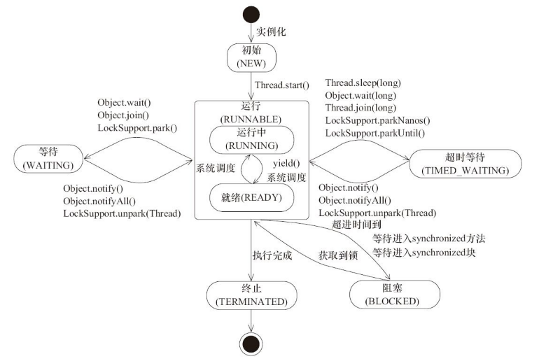

# 多线程

## 创建一个新线程的方法
1. 继承`Thread`类，重写`run()`方法。
2. 实现`Runnable`接口。
3. 实现`Callable`接口。

## 线程的状态
Java线程在其生命周期中可能处于6种状态，在一个特定的时刻，线程只能处于其中的一个状态。

| 状态          | 说明                                                         |
| ------------- | ------------------------------------------------------------ |
| NEW           | 初始状态，线程被创建出来，但还没有调用`start()`方法          |
| RUNNABLE      | 运行状态，包括就绪（READY）和正在运行（RUNNING）             |
| BLOCKED       | 阻塞状态，线程因资源而阻塞                                   |
| WAITING       | 等待状态，线程需要等待其它线程完成一些特定动作（通知或中断） |
| TIMED_WAITING | 超时等待状态，和WAITING类似，但是到了指定的超时时间会自动返回 |
| TERMINATED    | 终止状态，表示当前线程已经执行完毕                           |

以下是线程之间的状态迁移图：

## 实现多线程同步的方法
Java主要提供了3中实现同步机制的方法：
1. 使用`synchronized`关键字。
2. 使用`wait()`与`notify()`方法。
3. 使用`Lock`。

## Java中的原子操作
在Java中可以通过锁和循环CAS的方式实现原子操作。

JVM中的CAS操作是利用处理器提供的 **`COMPXCHG`**指令实现的。自旋CAS实现的基本思路是循环进行CAS操作直到成功为止。但CAS存在三个问题：
* **ABA问题**。可以使用版本号来解决。
* **循环时间长开销大**。这一般出现在自旋CAS长时间不成功的情况下。
* **只能保证一个共享变量的原子操作**。对于多个共享变量的原子操作，一般采用锁来解决，也可以将多个共享变量封装进一个对象，然后使用`AtomicReference`类来解决。

JVM内部实现了很多锁机制，有意思的是除了偏向锁，JVM实现锁的方式都用了循环CAS，即当一个线程进入同步代码块时使用循环CAS获取锁，离开同步代码块时使用循环CAS释放锁。

## `sleep()`方法与`wait()`方法的区别
`sleep()`与`wait()`都可以暂停线程执行，但它们还有一些区别：
1. 原理不同。`sleep()`是`Thread`类的静态方法，是线程自己用来控制自身执行的，它可以使线程自己暂停一段时间，把执行的机会让给其它线程，等睡眠时间一到，便会自动“醒来”。而`wait()`是`Object`类的静态方法，用于线程间的通信，这个方法会使当前持有对象锁的线程释放锁并进入等待状态，直至其它线程调用对象的`notify()`或`notifyAll()`方法才会醒来。`wait()`方法也支持设置超时时间。
2. 对锁的处理机制不同。调用`sleep()`方法只是让当前线程暂停一段时间，不涉及线程间通信，也不会释放锁。而调用`wait()`方法会释放锁。
3. 使用区域不同。`sleep()`方法可以在任何区域使用。而由于调用`wait()`方法前必须先获得对象锁，因此只能在同步代码块内使用。
4. 对异常的处理方式不同。调用`sleep()`方法时必须处理`InterruptedException`异常。而调用`wait()`方法时不用关心异常处理。

## `sleep()`方法与`yield()`方法的区别
`sleep()`方法与`yield()`方法都属于`Thread`类，它们的区别主要体现在：
1. 前者被调用后会立马进入阻塞状态，在一段时间内不会再执行。而后者只是使当前线程重新回到`RUNNABLE`状态，因此可能马上又被执行。
2. 前者在方法声明上抛出了`InterruptedException`异常，而后者没有声明任何异常。

## 参考资料
1. 《Java并发编程实战》及其原著.
2. 《Java并发编程的艺术》.
