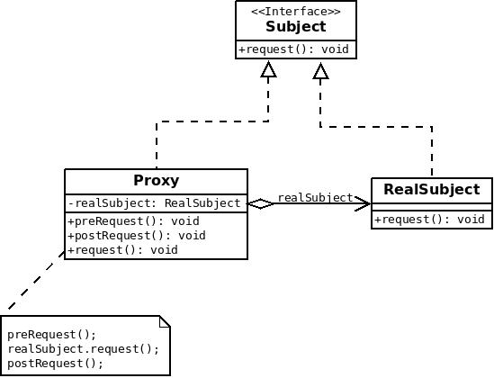

# 代理
[Wikipedia](https://en.wikipedia.org/wiki/Proxy_pattern#Java)中是这样描述`Proxy`的：
> A proxy, in its most general form, is a class functioning as an interface to something else. The proxy could interface to anything: a network connection, a large object in memory, a file, or some other resource that is expensive or impossible to duplicate. In short, a proxy is a wrapper or agent object that is being called by the client to access the real serving object behind the scenes. Use of the proxy can simply be forwarding to the real object, or can provide additional logic. In the proxy, extra functionality can be provided, for example caching when operations on the real object are resource intensive, or checking preconditions before operations on the real object are invoked. For the client, usage of a proxy object is similar to using the real object, because both implement the same interface.

## 代理模式
**代理模式(Proxy Pattern)**是一种常见的设计模式，其主要思想为：给某一个对象提供一个代理，并由代理对象控制对原对象的引用。

代理模式中引入了一个新的代理对象，代理对象可以在客户端和目标对象之间起到中介作用，去掉客户端不应该看到的内容或服务或者给客户端提供额外的服务。

### 模式实现
代理模式主要包含3个角色：
1. Suject(抽象主题类)：它声明了真实主题和代理主题共有的接口，似的在任何使用真是主题的地方都可以使用代理主题。
2. RealSubject(真实主题类)：它定义了代理角色所代表的真是对象，包含真实的业务操作，客户端可以通过代理对象间接的调用真实主题角色中定义的操作。
3. Proxy(代理类)：代理类包含一个对真实主题类的引用，从而可以在任何时候操纵真实主题对象。通常在代理类中，客户端在调用真实主题的方法的前后还会进行一些其它的操作，这可以由代理类提供。



根据UML图，可以写出以下代码：
```Java
public interface Subject{void request();}

public class RealSubject implements Subject {
    @Override
    public void request() {System.out.println("Request of RealSubject instance.");}
}

public class Proxy implements Subject {
    private final RealSubject realSubject = new RealSubject();

    public void preRequest(){System.out.println("PreRequest.");}
    public void postRequest(){System.out.println("PostRequest.");}

    @Override
    public void request() {
        preRequest();
        System.out.println("Request of Proxy.");
        realSubject.request();
        postRequest();
    }
}

public class Client {
    public static void main(String[] args) {new Proxy().request();}
}
```
运行 **`Client`**类，可以得到以下结果：
```txt
PreRequest.
Request of Proxy.
Request of RealSubject instance.
PostRequest.
```
在上面的代码中，客户端通过不仅代理类调用了真实主题类的方法，还在其前后调用了一些其它的方法。

### 小结
代理模式能够协调调用者和被调用者，在一定程度上降低了系统的耦合度，符合迪米特法则。客户端可以针对抽象接口编程，增加和更换代理类无须修改原有代码，符合开闭原则，利于系统的扩展。

由于代理对象出现在客户端和真实对象之间，这加大了客户端和真实对象之间的距离，可能会降低请求的处理速度。同时，代理模式的实现也需要额外工作，这可能加大系统的复杂性。

## JDK动态代理
**`java.lang.reflect.Proxy`**提供了在程序运行期间**动态**创建接口实现类(代理类`proxy class`)的方法，因为代理类是在程序运行过程中动态创建的，所以又被称为动态代理类(`dynamic proxy class`)，被实现的接口被称为代理接口(`proxy interface`)，代理类的实例被称为代理实例(`proxy instance`)。

### **`InvocationHandler`**接口
每个代理实例都有一个相关联的`invocation handler`对象，它实现了 **`InvocationHandler`**接口。**`InvocationHandler`**接口的定义如下：
```Java
public interface InvocationHandler {
    public Object invoke(Object proxy, Method method, Object[] args)
        throws Throwable;
}
```
代理实例上的方法调用会被转移到对应`invocation handler`的`invoke()`方法上。
由于一个接口可能声明了多个方法，`method`参数给出了将要在`proxy`上调用的方法，传递的参数列表为`args`。

### 创建代理
可以通过 **`Proxy`**类的静态方法`newProxyInstance(ClassLoader loader, Class<?>[] interfaces, InvocationHandler h) `来创建一个代理实例。我们需要提供加载代理类的 **`ClassLoader`**、代理类实现的所有接口组成的数组和一个`invocation handler`。

下面是一个例子：
```Java
// 接口
public interface Subject {
    Object execute();
}

// 接口实现类
public class RealSubject implements Subject {
    @Override
    public Object execute() {
        System.out.println("Real subject is executing.");
        return null;
    }
}

public class SubjectProxy implements InvocationHandler {
    private final Subject target;

    public SubjectProxy(Subject target) {this.target = target;}

    @Override
    public Object invoke(Object proxy, Method method, Object[] args) throws Throwable {
        return method.invoke(target, args);
    }
}

// 测试程序
public class SubjectProxyTest {
    public static void main(String[] args) {
        Subject subject = (Subject) Proxy.newProxyInstance(
                SubjectProxy.class.getClassLoader(),
                new Class[]{Subject.class},
                new SubjectProxy(new RealSubject()));
        subject.execute();
    }
}
```
程序的运行结果为：
```txt
Real subject is executing.
```

### 动态代理的局限性
被代理的类至少需要实现一个接口，若被代理的类没有实现任何接口，[cglib](https://github.com/cglib/cglib)是一个不错的选择。

## cglib
JDK的动态代理基于**反射**机制，生成一个**实现**代理接口的代理类，然后重写接口，实现方法增强，只能代理实现了接口的类。因为是基于反射，动态代理在生成类的时候非常快，但后续操作会很慢。

cglib采用了**字节码**技术，通过**继承**目标类并覆盖其中的方法来达到增强的目的，因此不能代理被`final`修饰的类。因为是基于字节码技术，cglib在生成类的时候很慢，但后续操作很快。

### 简单示例
```Java
public class Person {
    public String hello(String name) {
        System.out.println("Hello, " + name);
        return "Hello, " + name;
    }
}

public class PersonProxyTest {
    public static void main(String[] args) {
        Enhancer enhancer = new Enhancer();
        enhancer.setSuperclass(Person.class);
        enhancer.setCallback(new MethodInterceptor() {
            @Override
            public Object intercept(Object obj, Method method, Object[] args, MethodProxy proxy) throws Throwable {
                System.out.println("cglib methodintercept start...");
                Object result = proxy.invokeSuper(obj, args);
                System.out.println("cglib methodintercept end...");
                return result;
            }
        });
        Person personProxy = (Person) enhancer.create();
        personProxy.hello("Nicholas");
    }
}
```
运行这段代码，可以得到以下结果：
```txt
cglib method intercept start...
Hello, Nicholas
cglib method intercept end...
```
这段代码里面用到了 **`Enhancer`**类和 **`MethodInterceptor`**接口。这两者的作用和JDK动态代理里面的 **`Proxy`**和 **`InvocationHander`**有些类似。`setSuperClass(Class superclass)`告诉 **`Enhancer`**去生成一个`superclass`的子类，`setCallback(Callback callback)`告诉 **`Enhancer`**使用指定的`callback`来处理被代理类上的方法调用。**`MethodIntercepter`**实现了 **`Callback`**接口，允许我们对拦截的方法进行完全控制。

## 参考文献
1. [Proxy pattern](https://en.wikipedia.org/wiki/Proxy_pattern#Java).
2. 《设计模式的艺术：软件开发人员内功修炼之道》.
3. [Dynamic Proxy Classes](https://docs.oracle.com/javase/8/docs/technotes/guides/reflection/proxy.html).
4. [cglib: The missing manual](http://mydailyjava.blogspot.com/2013/11/cglib-missing-manual.html).