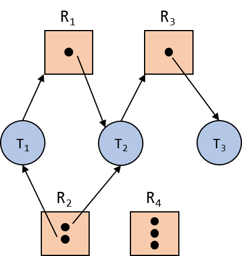
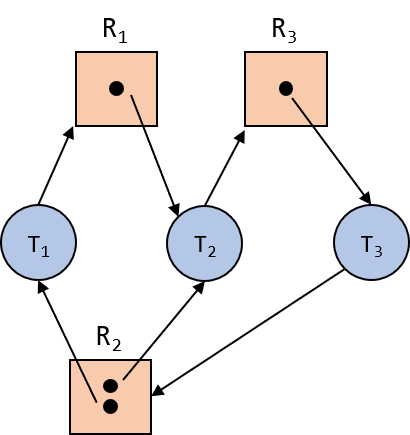
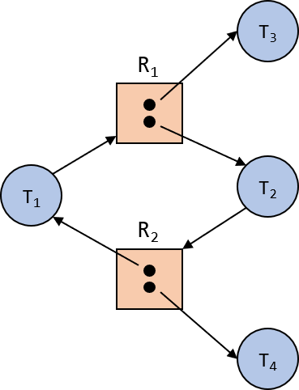
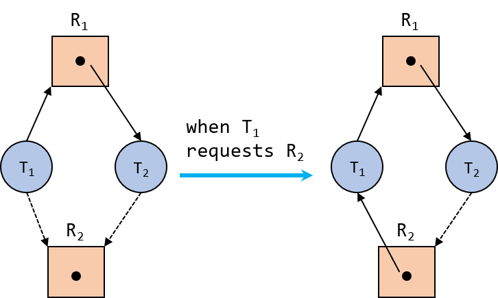

# 死锁
在多道程序设计环境中，多个线程可能会争夺有限的资源。线程先请求资源，若请求不能被立即满足，线程就会进入等待状态。有时候，两个线程各自持有不同的资源并等待对方所持有的资源，这种情况可能导致**死锁(deadlock)**。死锁的定义为：*every process in a set of processes is waiting for an event that can be caused only by another process in the set*。虽然定义中使用了进程，但这也适用于线程。

## 资源
大部分死锁是由线程无法获得互斥资源引起的，这些资源可以是各种硬件设备(如打印机)、也可以是一段信息(如数据库内的记录)。资源种类繁多，一类资源可以具有若干实例，任何一个实例都可以满足对该类资源的请求。简而言之，**资源(resource)**就是任何能够被获取、使用并最终释放的东西。线程在使用某个资源前必须先请求该资源，并且必须在使用完之后释放它。很明显，线程所请求的资源数量不得超过系统内资源的总量。

资源可以分为两种：**可抢占(preemptable)**的和**不可抢占的(nonpreepmptable)**。通常情况下，死锁和不可抢占资源有关。可抢占资源中潜在的死锁可以通过资源的重分配来化解。

一般情况下，和使用资源有关的事件如下：
* **请求**。线程请求资源，若请求不能被立即满足，线程必须等待。
* **使用**。线程在资源上执行某些操作。
* **释放**。线程释放资源。

资源的请求和释放可能是通过系统调用来完成的。例如，某些系统可能提供了诸如`request()/release()`、`open()/close()`或`wait()/signal()`一类的系统调用。对于被内核管理的资源，操作系统会维护一张系统表，表中记录了每个资源是空闲的还是已分配的(还会记录资源被分配给了哪个线程)。如果线程请求的资源已将被分配给其它线程，就将它加入到对应资源的等待队列中。

## 死锁的特征

### 死锁的必要条件
当以下四个条件同时满足时，就会出现死锁：
1. **互斥(Mutual exclusion)**。资源要么因其已被分配给某个线程而不可用，要么就是可用的。
2. **占有并等待(Hold and wait)**。线程持有至少一个资源并等待其它线程正持有的资源。
3. **非抢占(No preemption)**。在持有资源的线程完成前，该资源不可被其它线程抢占。
4. **循环等待(Circular wait)**。一组线程形成等待环路，环路中的每一个线程都在等待下一个线程持有的资源。

虽然死锁只有在以上四个条件同时满足时才会出现，但这四个条件并不是完全独立的。例如，*循环等待*条件暗示了*占有并等待*条件。

### 资源分配图
**系统资源分配图(system resource-allocation graph, RAG)**是一个有向图，它可以精确的描述死锁。它由一组顶点`V`和一组边`E`构成，其中，`V`又由两部分组成：系统中的所有活动线程`T`和系统中所有的资源类型`R`(注意是资源类型而不是资源数量)；`E`有两种类型：`request edge`和`assignment edge`，`request edge`$$T_i \to R_i$$表示线程$$T_i$$请求并等待资源$$R_j$$的实例，而`assignment edge`$$R_j \to T_i$$表示线程$$T_i$$已经持有一个资源$$R_j$$的实例。为了便于识别，我们用圆形表示线程，用矩形表示资源，在矩形内部用点表示资源的实例。

上图展示了这样一个资源分配情况。
集合`T`、`R`、`E`：
* $$T = \{T_1, T_2, T_3\}$$
* $$R = \{R_1, R_2, R_3, R_4\}$$
* $$E = \{T_1 \to R_1, T_2 \to R_2, R_1 \to T_2, R_2 \to T_1, R_2 \to T2, R_3 \to T_3\}$$

资源实例：
* 1个$$R_1$$实例。
* 2个$$R_2$$实例。
* 1个$$R_3$$实例。
* 3个$$R_4$$实例。

线程状态：
* 线程$$T_1$$持有1个$$R_2$$实例并等待一个$$R_1$$实例。
* 线程$$T_2$$持有1个$$R_1$$实例和1个$$R_2$$实例并等待1个$$R_3$$实例。
* 线程$$T_3$$持有1个$$R_3$$实例。

如果资源分配图中没有环，就说明线程之间没有死锁，否则说明**可能**存在死锁。现在来看有环的情况：
* 如果每种资源都只有一个实例，那么存在死锁。
* 如果环中只包含了资源类型的一个子集，若子集内的每种资源只有一个实例，那么存在死锁。
* 如果每种资源有多个实例，那么可能存在死锁。

下面是一个具有两个环($$T_1 \to R_1 \to T_2 \to R_3 \to T_3 \to R_2 \to T_1$$、$$T_2 \to R_3 \to T_3 \to R_2 \to T_2$$)的资源分配图。线程$$T_1$$、$$T_2$$和$$T_3$$死锁了，线程$$T_2$$在等$$T_3$$释放$$R_3$$，而$$T_3$$在等$$T_1$$或$$T_2$$释放$$R_2$$，$$T1$$也在等$$T_2$$释放$$R_1$$。

在看下面这张资源分配图，虽然其中有一个环($$T_1 \to R_1 \to T_2 \to R_2 \to T_1$$)，但不存在死锁。因为线程$$T_4$$可以释放一个资源$$R_2$$的实例，$$T_3$$获得这个实例之后图中就不存在环了。

## 死锁的处理
一般而言，我们有四种处理死锁的策略：
1. 忽略死锁。
2. 破坏死锁的四个必要条件之一，预防死锁的产生。
3. 谨慎分配资源，避免死锁的出现。
4. 检测死锁的发生并设法恢复。

### 鸵鸟算法
鸵鸟在遇到危险时，会将头埋在沙子里，假装看不见。这是最简单的解决方案，即忽略死锁。

### 死锁预防
死锁若发生，其四个必要条件必须同时满足。因此，只要能破坏死锁发生的四个必要条件之一，我们就能预防死锁。

破坏**互斥**条件。因为死锁是在访问共享资源时发生的，若资源不是共享的，那就不可能发生死锁。如果访问共享资源时不需要互斥(例如只读文件)，也不会发生死锁。

破坏**占有并等待**条件，有两种方法可以破坏它。一种方法是在线程运行之前就为它分配好需要的所有资源，这不太实用，因为大多数程序都是动态申请资源的。另一种方法是只允许线程不持有资源的情况下请求资源。以上两种方法都有缺陷：资源的利用率低，还可能产生饥饿现象。

破坏**非抢占**条件，我们可以这么干：如果线程在持有一些资源的情况下请求其它<u>不能立即得到</u>的资源，那么让该线程当前持有的资源都可以被抢占。换句话说，线程当前持有的资源是隐式释放了的。原线程可以在被抢占的资源归还后重启，就像这些资源刚被分配给它一样。

前面三种解决方案在大多数情形下都不太实用，有多种方法可以破坏**循环等待**条件，即避免环路的出现。一种方法时保证每个线程在任何时刻只能占用一个资源，若要请求另一个资源，就必须释放当前持有的资源。另一种方法就是对<u>所有</u>资源进行统一编号，线程可以在任何时刻请求资源，但所有的请求必须按照资源编号的顺序提出，这样不会出现环路。在任何时候，总有一个线程持有已分配资源中编号最大的那个资源(如果有资源被分配的话)，这个线程不能请求其它已分配的各种资源(编号肯定都小于它持有的那个最大编号)，它要么执行完毕，要么去请求编号更高的资源(总是可用的)。最终，它会执行完并释放占有的资源，这是其它的线程也可以以同样的方式执行完。

### 死锁避免
死锁避免算法通过动态检查资源的分配状态来确保不会发生循环等待。资源分配状态包括资源的可用数量、已分配数量及线程请求的数量。

#### 安全状态
如果系统按照某种顺序为每线程分配资源，可以使得每个线程都能拿到资源并执行完成，那么这样的资源分配顺序就是**安全序列(safe sequence)**。只要系统中存在至少一个安全序列，系统就处于**安全状态(safe state)**。反之，系统处于不安全状态，可能出现死锁。若线程序列$$<T_1, T_2, ..., T_n>$$是一个安全序列，那么对于线程$$T_i$$而言，$$T_i$$请求的资源数量不大于当前可用资源加上所有$$T_j(j < i)$$线程所占用的资源之和(当$$T_j$$执行完成后，会释放其占用的资源)。

#### 资源分配图算法
在每种类型的资源都只有一个实例的前提下，我们可以利用RAG来避免死锁的出现。具体做法是：引入一种新的边——`claim edge`。`claim edge`$$T_i \to R_j$$表示线程$$T_i$$在将来可能会请求资源$$R_j$$(`claim edge`在RAG中用虚线表示)。当线程$$T_i$$请求资源$$R_j$$时，就将`claim edge`$$T_i \to R_j$$转化为`request edge`$$T_i \to R_j$$；当资源$$R_j$$被线程$$T_i$$释放时，就将`assignment edge`$$R_j \to T_i$$转化为`claim edge`$$T_i \to R_j$$。

为了使RAG算法正确工作，只有在线程的所有`claim edge`被添加到RAG中之后，该线程才能被允许请求资源。或者，线程可以请求已经设置好的`claim edge`边关联的资源，并且不允许在线程持有资源的情况下添加`claim edge`到RAG。`claim edge`实际上起到了延迟RAG中环路出现作用。

为了更好的说明RAG算法，考虑下图，假设线程$$T_1$$请求资源$$R_2$$，尽管$$R_2$$当前未被占用，但我们也不能把它分配给$$T_1$$。因为这个举动将导致RAG中出现环路，系统将进入不安全状态。如果$$T_2$$请求$$R_2$$，并且$$T_1$$请求$$R_1$$，就会出现死锁。

#### 银行家算法
当资源有多个实例时，RAG算法就无法使用了，这个时候可以使用**银行家算法(banker's algorithm)**。算法要做的就是判断满足线程的资源请求是否会导致系统进入不安全状态，若是，则拒绝请求，否则予以分配，系统继续处于安全状态。

为了实现银行家算法，我们需要维护几个和资源分配状态有关的数据结构，其中`n`代表线程数，`m`代表资源种类数：
* **Available**。`m`维向量，其中`Available[i]`表示资源$$R_i$$的可用实例数。
* **Max**。`n x m`维矩阵，其中`Max[i][j]`表示线程$$T_i$$对资源$$R_j$$的最大需求数。
* **Allocation**。`n x m`维矩阵，其中`Allocation[i][j]`表示线程$$T_i$$当前持有资源$$R_j$$的实例数。
* **Need**。`n x m`维矩阵，其中`Need[i][j]`表示线程$$T_i$$要完成工作还需要的资源$$R_j$$的实例数。注意：`Need[i][j] = Max[i][j] - Allocation[i][j]`。

为了简化算法的表示，我们定义，对于长度为`n`的向量`A`和向量`B`，`A ≤ B if and only if A[i] ≤ B[i] for all i = 1,2,...,n`。

##### 安全性算法
为了使用银行家算法，我们需要判断系统是否处于安全状态。检测系统是否处于安全状态的算法如下：
1. 设`Work`和`Finish`分别是长度为`m`和`n`的向量。`Work`为可用资源的一个工作副本，它可以在分析过程中被修改，初始值为`Available`。`Finish`是一个布尔类型的向量，用来表示某个线程是否能够执行完成，其所有元素均初始化为`false`。
2. 找到一个满足`Finish[i] == false && Need[i] ≤ Work`的`i`。满足条件的线程还未完成，但可以为其分配资源。如果不存在这样的`i`，跳转到步骤4。
3. `Work = Work + Allocation[i]`，`Finish[i] = true`。这表示线程`i`执行完成并将其占用的资源归还到工作池。跳转到步骤2。
4. 如果所有的`i`都满足`Finish[i] == true`，那么系统当前处于安全状态，因为我们找到了一个安全序列。

为了判断系统是否处于安全状态，算法可能需要执行$$m \times n^2$$次。

##### 资源请求算法(银行家算法)
**资源请求算法(Resource-Request Algorithm)**用来判断某个请求的安全性，只有一个请求是安全的，才为其分配资源。若满足某个请求后系统仍处于安全状态，那么这个请求就是安全的。用`Request[i][j]`表示线程$$T_i$$请求资源$$R_j$$的实例数，当线程$$T_i$$发出一个资源请求时，将按照以下步骤处理：
1. 若`Request[i] ≤ Need[i]`，跳转步骤2。否则抛出错误，因为线程请求的资源数超过了它需要的最大值。
2. 若`Request[i] ≤ Available`，跳转步骤3。否则，由于资源不够，线程$$T_i$$必须等待。
3. 检查是否可以安全地满足`Request[i]`。先假装请求的资源已被授予，然后运行安全性算法检查系统是否仍然处于安全状态。若是，满足`Request[i]`，否则线程$$T_i$$必须等待直到`Request[i]`变成安全的。假装分配资源的伪代码为：
   * 可用资源减少：`Available = Available - Request[i];`
   * 已分配资源增加：` Allocation[i] = Allocaion[i] + Request[i]; ` 
   * 资源需求量减少：`Need[i] = Need[i] - Request[i]`。

##### 一个例子
假设系统中有5个线程，10个资源A实例、5个资源B实例和7个资源C实例，系统当前的快照状态如下：

| 线程    | Allocation(A, B, C) | Max(A, B, C) | Available(A, B, C) | Need(A, B, C) |
| ------- | ------------------- | ------------ | ------------------ | ------------- |
| $$T_0$$ | (0, 1, 0)           | (7, 5, 3)    | (3, 3, 2)          | (7, 4, 3)     |
| $$T_1$$ | (2, 0, 0)           | (3, 2, 2)    |                    | (1, 2, 2)     |
| $$T_2$$ | (3, 0, 2)           | (9, 0, 2)    |                    | (6, 0, 0)     |
| $$T_3$$ | (2, 1, 1)           | (2, 2, 2)    |                    | (0, 1, 1)     |
| $$T_4$$ | (0, 0, 2)           | (4, 3, 3)    |                    | (4, 3, 1)     |

运行银行家算法可以发现当前系统处于安全状态，因为存在一个安全序列$$<T_1, T_3, T_4, T_2, T_0>$$。

假设现在线程$$T_1$$需要请求1个资源A和2个资源C，即`Request[1] = (1, 0, 2)`。为了判断`Request[1]`是否是安全的，我们先检查`Request[i] ≤ Available`，条件成立，现在假装`Request[1]`已被满足，系统将进入一个新的状态：

| 线程    | Allocation(A, B, C) | Max(A, B, C) | Available(A, B, C) | Need(A, B, C) |
| ------- | ------------------- | ------------ | ------------------ | ------------- |
| $$T_0$$ | (0, 1, 0)           | (7, 5, 3)    | (2, 3, 0)          | (7, 4, 3)     |
| $$T_1$$ | (3, 0, 2)           | (3, 2, 2)    |                    | (0, 2, 0)     |
| $$T_2$$ | (3, 0, 2)           | (9, 0, 2)    |                    | (6, 0, 0)     |
| $$T_3$$ | (2, 1, 1)           | (2, 2, 2)    |                    | (0, 1, 1)     |
| $$T_4$$ | (0, 0, 2)           | (4, 3, 3)    |                    | (4, 3, 1)     |

现在检查系统是否处于安全状态，运行安全性算法，我们可以找到安全序列$$<T_1, T_3, T_4, T_0, T_2>$$。因此我们可以立即满足线程$$T_1$$的请求。满足线程$$T_1$$的请求之后，假设线程$$T_0$$又来请求资源，`Request[0] = (0, 2, 0)`，因为`(0, 2, 0) ≤ （2, 3, 0)`，所以我们假装资源已分配，系统的状态如下：

| 线程    | Allocation(A, B, C) | Max(A, B, C) | Available(A, B, C) | Need(A, B, C) |
| ------- | ------------------- | ------------ | ------------------ | ------------- |
| $$T_0$$ | (0, 3, 0)           | (7, 5, 3)    | (2, 1, 0)          | (7, 2, 3)     |
| $$T_1$$ | (3, 0, 2)           | (3, 2, 2)    |                    | (0, 2, 0)     |
| $$T_2$$ | (3, 0, 2)           | (9, 0, 2)    |                    | (6, 0, 0)     |
| $$T_3$$ | (2, 1, 1)           | (2, 2, 2)    |                    | (0, 1, 1)     |
| $$T_4$$ | (0, 0, 2)           | (4, 3, 3)    |                    | (4, 3, 1)     |

运行安全性算法会发现，我们找不到任何安全序列，所以不能满足线程$$T_0$$的这个请求。

### 死锁检测与恢复
当系统既不能预防也不能避免死锁，那死锁就有可能出现。这个时候，系统可能就需要具备检测死锁的存在并从死锁恢复的能力了。

#### 死锁检测

##### 每类资源只有一个实例的死锁检测
当RAG中存在环路时，可能存在死锁。因此，我们检测RAG中是否存在环路即可。

##### 每类资源有多个实例的死锁检测
当每类资源有多个实例时，我们可以利用银行家算法中的数据结构并稍微修改安全性算法来检测死锁的存在。算法如下：
1. 设`Work`和`Finish`分别是长度为`m`和`n`的向量。`Work`为可用资源的一个工作副本，它可以在分析过程中被修改，初始值为`Available`。`Finish`是一个布尔类型的向量，用来表示某个线程是否已经完成。若`Available[i] = 0`，则`Finish[i] = true`，否则`Finish[i] = false`。
2. 找到一个满足`Finish[i] == false && Request[i] ≤ Work`的`i`。满足条件的线程还未完成，但可以为其分配资源。如果不存在这样的`i`，跳转到步骤4。
3. `Work = Work + Allocation[i]`，`Finish[i] = true`。这表示线程`i`执行完成并将其占用的资源归还到工作池。跳转到步骤2。
4. 若存在`i`，使`Finish[i] == false`，那么系统中存在死锁。`Finish[i] == false`的线程就是已经发生死锁的线程。

假设系统中有5个线程，7个资源A实例、2个资源B实例和6个资源C实例，系统当前的快照状态如下：

| 线程    | Allocation(A, B, C) | Request(A, B, C) | Available(A, B, C) |
| ------- | ------------------- | ---------------- | ------------------ |
| $$T_0$$ | (0, 1, 0)           | (0, 0, 0)        | (0, 0, 0)          |
| $$T_1$$ | (2, 0, 0)           | (2, 0, 2)        |                    |
| $$T_2$$ | (3, 0, 3)           | (0, 0, 0)        |                    |
| $$T_3$$ | (2, 1, 1)           | (1, 0, 0)        |                    |
| $$T_4$$ | (0, 0, 2)           | (0, 0, 2)        |                    |

运行死锁检测算法，我们可以找到安全序列$$<T_0, T_2, T_3, T_1, T_4>$$使得`Finish`中所有元素均为`true`，因此当前系统中没有死锁。若当前系统的状态为(线程$$T_2$$多请求了一个资源C)：

| 线程    | Allocation(A, B, C) | Request(A, B, C) | Available(A, B, C) |
| ------- | ------------------- | ---------------- | ------------------ |
| $$T_0$$ | (0, 1, 0)           | (0, 0, 0)        | (0, 0, 0)          |
| $$T_1$$ | (2, 0, 0)           | (2, 0, 2)        |                    |
| $$T_2$$ | (3, 0, 3)           | (0, 0, 1)        |                    |
| $$T_3$$ | (2, 1, 1)           | (1, 0, 0)        |                    |
| $$T_4$$ | (0, 0, 2)           | (0, 0, 2)        |                    |

这个时候系统就存在死锁了。尽管我们可以回收线程$$T_0$$占用的资源，但也无济于事，线程$$T_1$$、$$T_2$$、$$T_3$$和$$T_4$$死锁了。

##### 死锁检测算法的使用
现在我们已经有死锁检测算法了，接下来的问题是何时去检测它们。一种方法是每当有资源请求时就去检测，虽然越早发现死锁越好，但这可能占用大量的CPU时间。另一种方法是每隔一段时间就检查一次，或者当CPU使用率降到一定阈值以下时去检查。考虑到CPU的使用效率，如果死锁线程达到了一定数量，就没多少线程可以运行了，所以CPU会经常空闲。

#### 从死锁恢复
当我们成功检测到了死锁，下一步就是采取一些方法使系统重新正常工作：
1. **利用抢占恢复**。临时将资源从一个线程抢占到另一个线程，另一个线程使用完就送回原线程。
2. **回滚**。周期性的创建检查点，当检测到死锁时，回退到某个之前的检查点继续。
3. **杀死进程**。杀死一个或多个进程，使之释放资源，便于其它线程正常运行。

## 和死锁相关的其它问题

### 活锁
**活锁(livelock)**不会阻塞线程，但线程也不能继续执行，因为线程将不断重复执行相同的操作，而且总会失败。这就像两个过于礼貌的人在半路上面对面地相遇：他们彼此都给对方让路，然后又在另一条路上相遇了，并且他们就这样反复地避让下去。可以在重试机制中引入**随机性**来解决问题，这样能减少冲突。

### 饥饿
当线程由于无法访问它所需要的资源而不能继续执行时，就发生了**饥饿(Starvation)**。例如：Java应用程序对线程的优先级设置不当，导致部分线程无法获取CPU时钟周期。可以通过FIFO策略来避免饥饿，也可以在引入老化机制，动态的调整线程优先级，使每个线程的优先级都有机会变成最高的。

## 参考资料
1. ANDREW S. TANENBAUM, HERBERT BOS. <i>Modern Operating Systems, 4th Edition</i>. Pearson, 2015.
2. Abraham Silberschatz, Greg Gagne, Peter B. Galvin. <i>Operating System Concepts, 10th Edition</i>. Wiley, 2018.