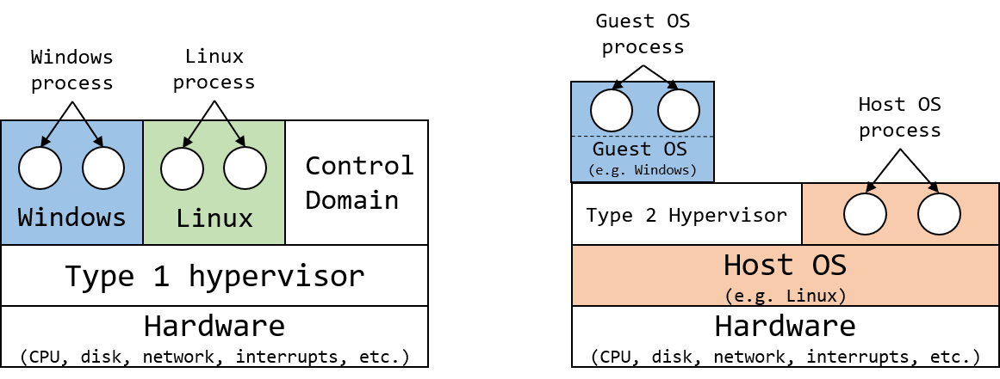

# 虚拟机
虚拟化的主要思想是**虚拟机监视程序(Virtual Machine Monitor, VMM)**在同一物理机上创建出有多台(虚拟)机器的假象，VMM又称**虚拟机管理程序(hypervisor)**。我们可以将hypervisior分为两类：第一类hypervisor和第二类hypervisor。前者运行在裸机上，而后者主要依赖于底层操作系统提供的服务和抽象。无论采用何种方式，虚拟化技术都允许在单一计算机上运行多个虚拟机，并且这些虚拟机能运行不同的操作系统。

## type 1 and type 2 hypervisors
有两种类型的hypervisor：
1. Type 1 hypervisors (native/bare metal hypervisors).
2. Type 2 hypervisors (hosted hypervisors).

Goldberg对两类虚拟化技术进行了区分。从技术的角度看，一类hypervisor更像是一个操作系统，因为它是唯一一个运行在最高特权模式下的程序。二类hypervisor是一个依赖操作系统分配和调度资源的程序，就像是一个普通的进程，尽管如此，它还是伪装成了一个具有CPU和各种设备的完整计算机。

## 参考资料
1. Modern Operating Systems (4th Edition).