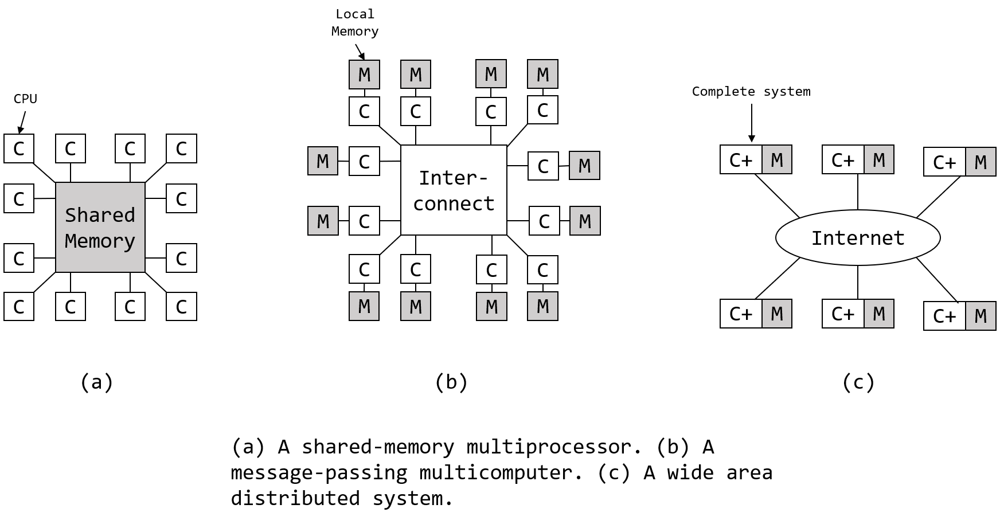
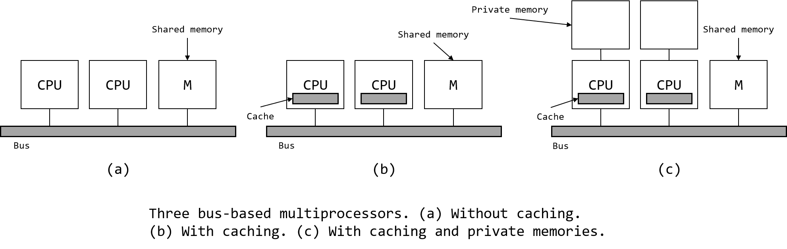
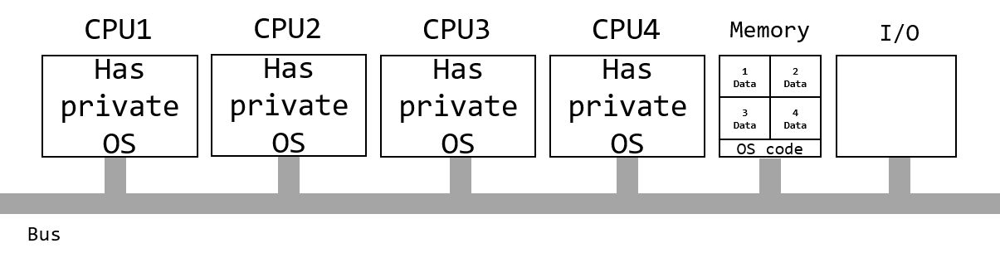
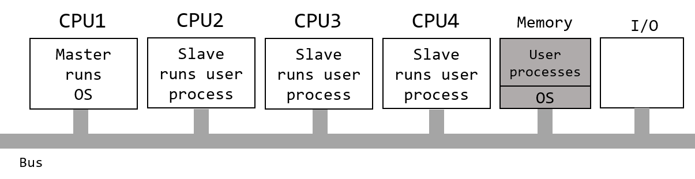
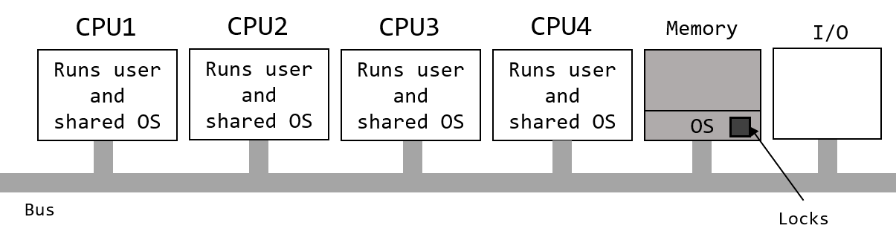

# 多处理机系统
从计算机诞生之日起，人们就无休止地追求着更强大地计算能力。过去地解决方案是<u>使时钟走得更快</u>，但是现在时钟速度已经很难再进一步提升了。计算机虽然可以变得很小，但是会遇到**散热**问题：计算机运行得越快，产生的热量就越多，而计算机越小散热越难。总而言之，对于计算机的时钟来说：从1MHz到1GHz需要的是更好的芯片制造工艺，而从1GHz到1THz需要的是完全不同的方法。

获得更强计算能力的另一种方法是<u>大量使用并行计算机</u>。这些机器都拥有很多CPU，虽然每个CPU的速度都和普通的CPU一样，但是它们总体的计算能力比单个CPU要强大得多。

电子部件之间的所有通信的本质就是它们之间发送具有良好结构定义的位串，其差别在于所涉及的时间范围、距离范围和逻辑组织。上图展示了三种不同的并行计算机系统模型：
* (a)图展示了一个极端的例子，系统中的所有CPU通过共享内存通信，每个CPU都可以读写整个物理存储器，访问一个内存字通常需要1~10ns。
* 在(b)图所示的系统中，许多CPU-内存通过高速互联网络连接在一起，这种系统被称为消息传递型计算机。每个内存都局部对应一个CPU，并且只能被该CPU访问。这些CPU通过互联网络发送多字信息通信，一条短消息通常可在10~50μs内发出，但是内存访问时间仍然比(a)中系统要长。
* (c)中所有的计算机系统都通过一个广域网连接，形成一个分布式系统。每台计算机都有自己的内存，计算机之间通过消息传递进行通信，消息传递的时间通常为10~100ms。如此长的延迟会造成使用这类**松耦合**系统的方式和(b)中的**紧耦合**方式不同。

三种类型的系统在通信延迟上各不相同，分别有三个数量级的差别。

## 多处理机(MULTIPROCESSORS)
**共享内存多处理机(shared-memory multiprocessor)**是一种多个CPU以完全共享地方式访问同一个公用RAM的计算机系统。运行在任何一个CPU上的程序都能看到一个普通的虚拟地址空间。

### 多处理机硬件
所有的多处理机中的每个CPU都可以访问全部的共享内存。若机器上读取每个内存字(memory word)的速度都是一样快的，则称这种机器为**UMA(Uniform Memory Access)**，否则称这种机器为**NUMA(Nonuniform Memory Access)**。

#### UMA

##### 基于总线的UMA
下图展示了三种基于总线的UMA:

最简单的多处理机是基于单总线的(图(a))。多个CPU以及一个或多个内存模块通过公用的总线进行通信。当一个CPU需要读取一个内存字时，它会先检查总线是否空闲。如果总线忙，它就等待直到总线空闲。当总线空闲时，CPU把所需字的地址放到总线上，发出控制信号，然后等待内存将它所需的字放到总线上。这种设计存在问题，当CPU数量不多时，总线的使用权是很好管理的，一旦CPU数量过多，总线的管理就变得异常复杂。此外，总线成为了系统的瓶颈，多数CPU在大部分时间内是空闲的。

为了解决这一问题，可以为每个CPU添加一个高速缓存(图(b))。CPU可以直接从高速缓存中读取数据，总线流量大大减少。一般而言，高速缓存的读取单位不再是单个字，而是一个高速缓存行(cache line)。为了防止数据出现不一致现象，需要执行缓存一致性协议。

图(c)中的每个CPU不仅有一个高速缓存，还有一个私有内存。CPU通过专门的私有总线访问这个私有内存。为了利用这一配置，编译器应该把所有程序的代码、字符串、常量以及其它只读数据放入私有内存，而将程序的共享变量放入共享内存。在多数情况下，这种配置可以极大的减少总线流量，但是这需要编译器的积极配合。

##### 其它UMA
除了基于总线的UMA，还有基于交叉开关和多级交换网络的UMA。

连接n个CPU和k个内存的最简单的电路就是**交叉开关(crossbar switch)**。将n个CPU和k个内存排列成一个n×k的矩阵，矩阵中的每个位置都是一个**交叉点(crosspoint)**。交叉点是一个小的电子开关，其开关状态取决于对应的CPU和内存是否需要连接。交叉开关是一个**非阻塞网络**，即不会因为有些交叉点被占据而拒绝连接。当两个CPU同时访问同一个内存时，还是可能出现竞争的。不过通过将内存分为k个单元，竞争的概率降低到了`1/k`。交叉开关的缺点是：交叉点的数量会以`n×k`的方式增长，对于大规模的系统并不适用。

**多级交换网络(multistage switching networks)**是另外一种完全不同的设计，由2×2的交叉开关构建。对于一个2×2的开关(两输入和两输出)，到达任意一个输入的消息可以被交换到任意一个输出上。omega网络就是典型的多级交换网络。

#### NUMA
单总线的UMA多处理机通常只限于拥有数十个CPU的系统，交叉开关和多级交换网络需要大量(昂贵)的硬件，并且也不能太大。为了支持100个及更多的CPU，必须做一些改变，这就导致了NUMA的出现。NUMA和UMA一样，都为所有的CPU提供了蛋依的地址空间，但是在NUMA中，对局部内存模块的访问要比远端内存模块的访问要快。虽然为UMA编写的程序可以不经修改就在NUMA机器上运行，但是其效率会比在UMA上差。

所有的NUMA机器都具备一下三种关键特性，他们也是NUMA与其它多处理机的主要区别：
1. 具有对所有CPU都可见的单个地址空间。
2. 通过`LOAD`和`STORE`指令访问远端内存。
3. 对远端内存的访问慢于局部内存。

若机器必须访问远端内存(因为需要的数据没有被缓存)，系统被称为**NC-NUMA (Non Cache-coherent NUMA)**。当cache处于一致状态时，系统被称为**CC-NUMA (Cache-Coherent NUMA)**。

#### 多核芯片
随着芯片制造技术的发展，晶体管的体积越来越小，从而有可能将越来越多的晶体管放入一个芯片中。随后的问题是：“如何利用这些晶体管？”，其中的一个选择时给芯片添加cache。当cache的大小达到一定程度时，继续增加cache的大小虽然有可能提高命中率，却不能显著提升应用的性能。另一个选择是将两个或更多的CPU(通常称为**核(core)**)放到同一个芯片上。在**多核(multicore)**芯片中，cache仍然是至关重要的，并且遍布整个芯片。多核芯片通常被称为**片级多处理机(Chip-level MultiProcessors, CMP)**。

#### 众核芯片
“多核”只是简单的表示核的数量多于一个，但是当核的数量持续增加时，它们就就有了另一个名称——众核。**众核(manycore)**芯片是指包括几十、几百甚至成千上万个核心的多核处理器。

超大量核带来了一个问题：用来保持缓存一致性的机制会变得异常的复杂。很多工程师担心硬件上保持缓存一致性的开销会非常高，以至于这些新增的核并不能带来多大的性能提升，因为处理器一直忙于维护缓存状态的一致性。更加糟糕的是，保持缓存目录的一致性还将消耗大量的内存，这就是著名的**一致性堡垒(coherency wall)**。

**GPU**是目前最常见的众核处理器，它拥有专用的内存和成千上万个微小的核。

### 多处理机操作系统

#### 每个CPU都有自己的操作系统
组织一个多处理机操作系统的最简单办法可能就是：静态的将内存划分为和CPU一样多的部分，为每个CPU提供私有内存及私有操作系统副本，以n各CPUn各独立计算机的形式运行。这样的优点是：允许所有的CPU共享操作系统的代码，而且只需要提供数据的私有副本。

这一机制比有n个分离的计算机要好，因为它允许所有的机器共享同一套磁盘、内存和其它I/O设备。但这一设计存在不少潜在的问题：因为进程不是共享的，所以可能出现一个CPU过载而其它CPU空载；因为物理页也不是共享的，所以可能一个CPU不断地进行页调度而另一个CPU有多余的页；由于操作系统独立的维护近期使用过的磁盘块的cache，可能出现某一修改过的磁盘块同时出现在多个cache中，这回导致不一致的结果。避免这一问题的唯一途径是取消cache，但这样会显著降低性能。

#### 主从多处理机
下面展示的模型是**主从模型(master-slave)**，CPU1为主CPU，其它为从CPU：

在这种模型下，操作系统的一个副本及其数据都都在CPU1上，用户进程运行在其它CPU上。随后所有的系统调用都被重定向到CPU1上，如果CPU1上有剩余的时间片，还可以运行用户进程。

主从模型解决了分区模型中的多数问题，但是主CPU成为了系统的瓶颈，因为它要处理所有的系统调用。这种模型对小型多处理机是可行的，但不适用于大型多处理机。

#### 对称多处理机
**对称多处理机(Symmetric MultiProcessor, SMP)**消除了上述的不对称性，在内存中有操作系统的一个副本，但任何CPU都可以运行它。当有系统调用时，进行系统调用的CPU陷入内核并进行处理。

这个模型动态地平衡进程和内存，因为它只有一套操作系统数据表。它还消除了主CPU带来的瓶颈问题。因为没有主CPU，所以需要解决多个CPU可能同时运行操作系统代码的问题。最简单的办法就是在操作系统中使用互斥信号量，如果互斥信号量被锁住，就等待。按照这种方式，任何CPU都可以运行操作系统，但在任一时刻只有那个获得锁的CPU可以运行操作系统，这一方法被称为**大内核锁(Big Kernel Lock, BLK)**。

### 多处理机调度
**亲和调度(affinity scheduling)**：尽量使一个线程在它前一次运行过的同一个CPU上运行。

**群调度(Gang scheduling)**：把一组相关的线程作为一个单位(群, gang)一起调度，使一个群内的所有线程在不同的CPU上同时运行，并且群中的所有线程共同开始和结束其时间片。

## 多计算机
多处理机提供了一个简单的通信模型：所有的CPU共享一个共用内存。进程可以向内存写消息，然后消息可以被其它进程读取，可以使用互斥锁、信号量、管程和其它合适的技术进行同步。唯一美中不足的是：大型多处理机构造困难，造价高昂。

为了解决CPU数量不断增加的问题，人们在**多计算机(multicomputers)**领域进行了很多研究。多计算机的CPU紧耦合在一起，并且不共享内存，每个CPU都有自己的私有内存，CPU之间通过互联网络连接。这些系统拥有各种其它的名称，如**机群计算机(cluster computers)**、**工作站机群(Clusters of Workstations, COWS)**。

多计算机很容易构造，因为其基本部件只是一台配有高性能网卡的PC裸机，不需要键盘、鼠标或显示器。

### 多计算机硬件
一个多计算机系统的基本节点包括一个CPU、内存、一个网卡、有时还有一块硬盘。

#### 互连技术
每个节点都有一块网卡，通过电缆或光纤连接到其它的节点或者交换机上。常见的互连拓扑结构有：星型、环型、网格、双凸面、立方体和四维超立方体等。

在多计算机中可采用两种交换机制：**存储转发包交换**和**电路交换**。

#### 网络接口
在多计算机中，每个节点都有一块网卡，网卡上一般会有一块用来存储进出包的RAM。通常，在包被传送到第一个交换机之前，这个包必须被复制到网卡的RAM中。这么做的原因是许多互连网络是同步的，这意味着一旦一个包开始传送，比特率就必须以恒定的速率持续进行。如果包在主RAM中，由于内存总线上其它的信息流的存在，所以不能保留送到网络上的流是连续的，而网卡上专用的RAM就解决了这个问题。同样的问题也出现在包的接收过程中。

### 底层通信软件
在多计算机中包的过度复制是高性能通信最大的敌人。在最好的情况下，包只需要3次复制：源RAM到源网卡、源网卡到目的网卡、目的网卡到目的RAM，这一过程还必须不涉及任何的存储转发并且网卡是被映射到用户空间的。如果网卡被映射到内核空间而不是用户空间，那么用户进程只能通过发出一个陷入到内核的系统调用来完成包的复制，这样一来，包复制的次数就变成了5次。

### 用户层通信软件
在多计算机中，不同CPU上的进程通过互相发送消息来通信。在最简单的情况下，这种消息传送是暴露给用户进程的。换句话说，操作系统提供了一种发送和接收消息的途径，而库过程调用使得这些底层的调用可以被用户进程使用。

#### 发送和接收
这是最简化的情形，操作系统提供两个库调用给用户进程：一个用户发送消息，另一个用于接收消息。

#### 阻塞调用和非阻塞调用
**阻塞调用**有时候称**同步调用**。当一个进程调用发送方法时，它会阻塞直到消息完全发送出去，然后继续执行发送方法后面的指令。接收过程也类似。

相对于阻塞调用的另一种方式是**非阻塞调用**，又称**异步调用**。由于进程在传输过程中可能重写缓冲区，非阻塞调用必须保证缓冲区的安全。有三种解决方案：
1. 让内核复制消息到内核缓冲区，然后让进程继续。
2. 在发送消息完全之后中断发送者，告知其缓冲区又可以使用了。
3. 让缓冲区采用Copy-on-Write的方式。

## 分布式系统
**分布式系统(distributed system)**与多计算机类似：每个节点都有自己的私有内存，整个系统中没有共享的物理内存。但是分布式系统中节点的耦合度比多处理机更低。分布式系统构建在计算机网络的上层，通过在操作系统的顶部加一层叫做**中间件(middleware)**的软件来处理不同硬件与操作系统的差异，为应用程序和用户提供一致的范型。从某种程度上来看，中间件就是一个分布式操作系统。

### 基于文档的中间件
**万维网(World Wide Web)**可以看作是一个分布式操作系统。Web本质上是一个客户端-服务器系统，其背后得原始范型却非常简单：每个计算机可以持有一个或多个被称为**Web页面(Web page)**的文档，每个页面中有文本、图像、音视频等，还有链接到其它页面的**超链接(hyperlink)**。用户通过浏览器向服务器请求Web页面，并可以通过页面中的超链接跳转到其它页面。由于超链接的存在，Web本身成为了一个由文档构成的巨大的有向图。每一个Web页面都有一个唯一的地址，称为**统一资源定位符(Uniform Resource Locator, URL)**，其具体形式为`protocol://DNS-name/file-name`，常见的协议有HTTP、FTP等，URL唯一指定一个文件。

当用户在Web浏览器中键入一个URL时，浏览器按照一定的步骤调取所请求的Web页面。例如，当访问`http://www.minix3.org/getting-started/index.html`时，浏览器按照以下步骤取得所需要的页面：
1. 浏览器向DNS询问`www.minix3.org`的IP地址。
2. DNS告诉浏览器IP地址为66.147.238.215。
3. 浏览器建立一个到66.147.238.215上端口80的TCP连接。
4. 浏览器发送对文件`getting-started/index.html`的请求。
5. `www.minix3.org`服务器发送文件`getting-started/index.html`给浏览器。
6. 浏览器展示`getting-started/index.html`中的文本内容。
7. 同时，浏览器获取并展示页面上的所有图片。
8. 浏览器释放TCP连接。

### 基于文件系统的中间件
Web背后得思想是使一个分布式系统看起来像一个巨大的超链接集合。另一种处理方式则是使一个分布式系统看起来像一个巨大的文件系统。

采用文件系统模型的分布式系统意味着只存在一个全局文件系统，用户能够读取其权限集合内的文件。一个进程将数据写入文件，另一个进程从文件中读出数据，进程之间的通信就实现了。

#### 传输模型
**上传/下载模型(upload/download model)**和**远程访问模型(remote-access model)**是不同的两种传输模型。

在第一种模型中，客户端通过将远程服务器上的文件复制到本地来实现对远程文件的访问。如果只是读文件，读取操作在本地完成之后就完事儿(为了高性能)。而如果是写文件的话，写入操作也在本地进行，当操作完成后，新的文件会被上传回服务器。上传/下载模式的优点是简单，而且一次性传送整个文件比只传输一小块更有效率。由于需要在本地存放整个文件，客户端必须拥有足够的空间。即使只需要文件的一小部分也需要整个文件，这是一种浪费，也是这种模型的缺点。

在第二种模型中，文件始终位于服务器上，客户端通过向服务器发送相关指令来完成各项操作。

### 基于对象的中间件
和前面的一切皆文档或一切皆文件不同，基于对象的中间件的思想是一切皆对象。对象是变量的集合，这些变量与一套被称为方法的访问过程绑定在一起。进程不被允许直接访问这些变量，相反，进程必须通过调用方法来访问它们。

C++和Java这类编程语言是面向对象的，但这里的对象只是语言级别的对象，而不是运行时刻的对象。**CORBA**就是一个知名的基于运行时对象的系统。

### 基于协作的中间件
分布式系统中还有一个泛型就是所谓的**基于协作的中间件(coordination-based middleware)**。**Linda**就是一个典型的例子，它是一个用于通信和同步的系统。

**发布/订阅(publish/subscribe)**就是受Linda启发而出现的基于写作的模型。模型由大量通过某种方式互联的进程组成，一个进程可以是消息生产者，也有可能是消息消费者，还有可能两者都是。生产者将生产的消息放到一个特定的地方，完成消息的**发布**，而消费者通过**订阅**其感兴趣的消息，以获得响应的通知。

