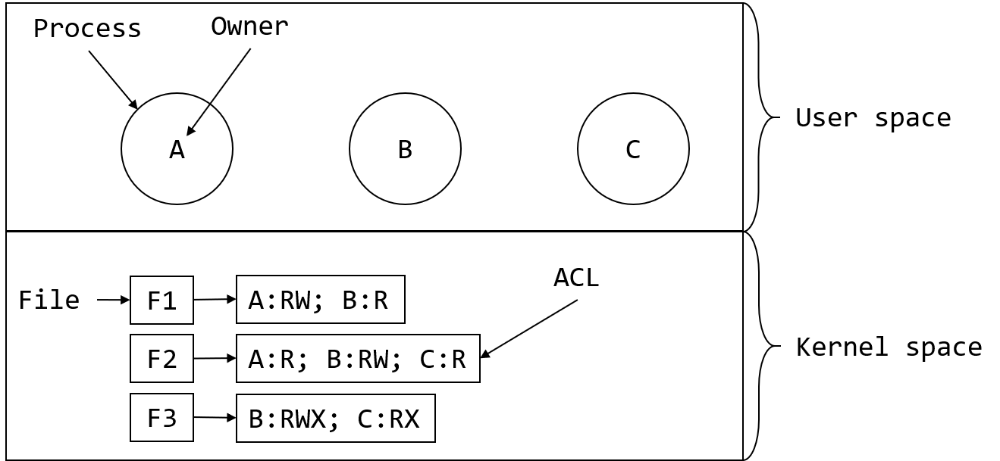
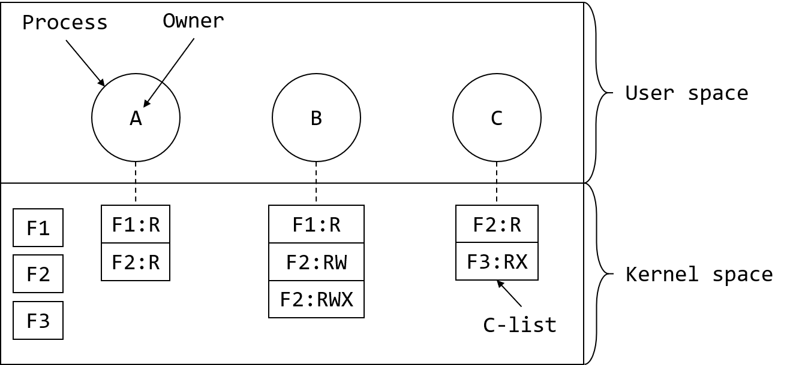
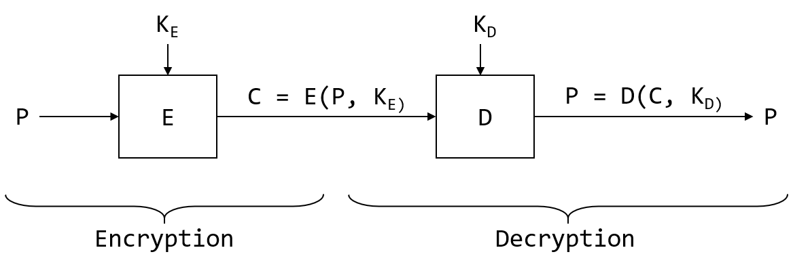

# 安全

## 安全环境

### 威胁
信息系统的安全性目标通常可以分解为三个部分:
1. **机密性(confidentiality)**：是机密的数据处于保密状态。系统应该保证数据不被未经授权的用户访问。
2. **完整性(integrity)**：未经授权的用户无法在未经数据拥有着授权的情况下修改任何数据。这里的数据修改不仅包括修改数据本身，还包括删除或添加错误数据。
3. **可用性(availability)**：没有人可以扰乱系统使之不可用。

这三个部分通常被称为CIA。它们受到的威胁各不相同：

| 目标       | 威胁     |
| ---------- | -------- |
| 数据机密性 | 数据暴露 |
| 数据完整性 | 数据篡改 |
| 系统可用性 | 拒绝服务 |

## 操作系统安全
一般而言，攻击可以分为被动攻击和主动攻击。被动攻击试图窃取信息，而主动攻击会使计算机行为异常。**加密(cryptography)**以某种方式对消息或文件进行转码，使攻击者在没有密钥的情况下很难恢复出原内容。**加固(hardening)**是指在程序中加入保护机制以加大攻击者破坏程序的难度。

### 可信计算基
**可信系统(trusted systems)**在形式上申明了安全要求并满足了这些安全要求。每一个可信系统的核心是最小的**可信计算基(Trusted Computing Base, TCB)**，它包含了实施所有安全规则所必须的硬件和软件。

## 保护机制

### 保护域
计算机系统内有许多需要保护的“**对象**”，这些对象可以是硬件，也可以是软件。**权限**是进行某个操作的许可。为了讨论不同的保护机制，需要引入域的概念。**域(domain)**是(对象，权限)对的集合，每一个(对象，权限)对都制定了一个对象和一些可在其上进行的操作的子集。

需求决定对象被分配到的域，一个基本的原则就是**最少权限原则(Principle of Least Authority, POLA)**。一般而言，当每个域中只含有完成其工作所需要的**最少**的对象和权限时，安全性最好。

为了跟踪对象所属的域，我们可以建立一个矩阵，矩阵的行代表域，列代表对象，然后在矩阵中的每个元素中列出对象在该域中所包含的权限。例如，下面的表中展示了三个域和8个对象：

|          | File1 | File2 | File3 | File4 | File5 | File6 | Printer1 | Plotter2 |
| -------- | ----- | ----- | ----- | ----- | ----- | ----- | -------- | -------- |
| Domain 1 | R     | RW    |       |       |       |       |          |          |
| Domain 2 |       |       | R     | RWX   | RW    |       | W        |          |
| Domain 3 |       |       |       |       |       | RWX   | W        | W        |

在实际应用中，很少采用上述矩阵的方式来存储权限信息，因为矩阵过大并且过于稀疏，非常浪费空间。但还有两种可行方法，它们通过按行或按列来存储这个矩阵并只保存非空元素。

### 访问控制列表
先来看按列存储，为每个对象关联一个(有序)列表，列表里面包含了所有可访问该对象的所有域以及这些域访问该对象的方法。这个列表就是**访问控制列表(Access Control List, ACL)**。例如：下图展示了三个进程A、B、C，每个进程都属于不同的域。F1、F2、F3为三个文件，每个文件都有一个相关联的ACL。若假设一个域相当于一个用户，那么我们就有用户A、B、C，在安全性语言里，用户通常被叫做**主体(subject或principal)**，而它们所拥有的为**对象(object)**(比如文件)。

很多系统中也支持**组(group)**的概念，组可以有自己的名字并包含在ACL中。在某些系统中，每个进程除了UID外，还有GID。这类系统中的ACL可能长这样：UID1, GID1: 
rights1; UID2, GID2: rights2; ...

这样，当出现访问对象的请求时，必须同时检查调用者的UID和GID。如果它们都出现在ACL中，所列出的权限就是可行的，否则访问会被拒绝。组也可以看作是**角色(role)**的概念。

### 权能字
现在来看按行存储的方式。这个时候与每个域(或进程)关联的是可访问的对象列表，以及进程可在对象上执行的操作。这样一来，每个进程就具有一个**权能字列表(capability list or C-list)**，里表中的每个单独的元素就是一个**权能字(capobility)**。下图展示了A、B、C三个进程的权能字，每一个权能字赋予所有者在特定对象上的权限：

很明显，操作系统必须防止用户篡改权能字列表。已知的保护方法有三种:
1. 建立带标记的体系结构。在这种硬件设计中，每个内存字必须拥有额外的位(或标记位)来判断该字是否包含了权能字。标记位不能被算术、比较等指令使用，仅可以被在内核态下运行的程序修改。
2. 在操作系统内保存权能字列表，随后根据权能字在列表中的位置引用权能字。
3. 把权能字列表放在用户空间中，并用加密的方法进行管理，这样用户就不能篡改它们。这种方法比较适合分布式操作系统。

## 密码学原理
加密的目的是通过某种手段将**明文(plaintext)**加密成**密文(ciphertext)**，只有被授权的人才知道如何将密文恢复为原来的明文。而对于无关的人来说，密文就是一段无法理解的编码。

在算法中使用的加密参数叫做**密钥(key)**。如果用P表示明文，$$K_E$$表示加密密钥，C表示密文，E表示加密算法，那么加密就可以定义为：$$C = E(P, K_E)$$。荷兰密码学家Kerckhoffs于19世纪提出了**Kerckhoffs原则**，认为：<u>加密算法本身应该完全公开，而加密的安全性由独立于加密算法之外的密钥决定</u>。

同样地，若用D表示解密算法，$$K_D$$表示解密密钥，则$$P = D(C, K_D)$$。加密与解密运算地关系如下：

**私钥加密技术**或**对称加密技术**使用同一个密钥进行加密和解密，而**公钥加密技术**中地加密密钥和解密密钥是不同的。

## 认证
每一个安全的计算机系统一定会要求所有的用户在登录的时候进行身份认证。最简单的认证方式就是通过密码认证，此外还有像智能卡这样的物理认证以及像指纹和虹膜这样的生物识别认证。

## 软件漏洞
入侵用户计算机的主要方法之一就是利用系统中运行的软件的漏洞，使其做一些违背开发者本意的事情。**缓冲区溢出攻击**是一种非常常见的利用软件漏洞发起攻击的方式。

## 恶意软件
**恶意软件(malware)**是一个统称，包括木马、病毒、蠕虫一起其它能够产生恶意行为的软件。

### 特洛伊木马
很多攻击者会编写一些有用的程序，并将恶意代码嵌入其中，然后提供免费下载。当人们下载并安装这些程序之后，恶意代码也就存在于用户的计算机上了，这种攻击方式叫做**木马攻击(Torjan horse attack)**。

### 病毒
**病毒(virus)**是一种特殊的程序，它可以通过将自己植入其它应用程序中来进行“繁殖”，就像生物界中真正的病毒一样。常见的病毒有七种：
* 共事者病毒(companion virus)并不真正感染程序，但当程序执行时它也执行。
* 可执行程序病毒(executable program virus)会感染可执行程序。其中最简单的一种叫做覆盖病毒(overwriting virus)，还有寄生病毒(parasitic virus)以及空腔病毒(cavity virus)。
* 内存驻留病毒(memory-resident virus)总是驻留在内存中。
* 引导扇区病毒(boot sector virus)可以覆盖主引导记录或者引导扇区，并能造成灾难性的后果。
* 设备驱动病毒(device driver virus)会感染设备驱动程序。
* 宏病毒(macro virus)利用宏文件执行恶意操作。
* 源代码病毒(source code virus)的移植性最强，当程序运行时，病毒也会被调用。

### 蠕虫
**蠕虫(worm)**是一个能够自我复制的程序，能够在迅速完成自我复制，然后迅速传染到所有的机器。
